# Lab 1: Build an instructions-based geo locator game agent using Microsoft 365 Agents Toolkit

**Estimated time:** 30 minutes

## Objective

The objective of this lab is to empower participants to build a declarative agent for Microsoft Copilot using Microsoft 365 Agents Toolkit. By completing the lab, participants will create a geo-location game that provides a fun and educational break from work. The lab focuses on understanding the structure of declarative agents, configuring them with instructions, and integrating them into the Microsoft 365 ecosystem for customized Copilot interactions.

## Solution

Participants will install Microsoft 365 Agents Toolkit in Visual Studio Code and set up their development environment. Using a template, they will scaffold a declarative agent named Geo Locator Game. They will customize the agent's instructions and update its configuration files, such as `instruction.txt` and `manifest.json`. The lab also guides participants in enhancing the agent with unique identifiers, custom icons, and testing functionality. The result is a fully functional, engaging Copilot application tailored to deliver clues about cities while integrating seamlessly with Microsoft 365.

## Exercise 1: First declarative agent

In this lab, you'll build a simple declarative agent using Microsoft 365 Agents Toolkit for Visual Studio Code. Your agent is designed to give you a fun and educational break from work by helping you explore cities across the globe. It presents abstract clues for you to guess a city, with fewer points awarded the more clues you use. At the end, your final score will be revealed.

In this exercise, you will learn:

- What a declarative agent for Microsoft Copilot is

- How to create a declarative agent using a Microsoft 365 Agents Toolkit template

- How to customize the agent to create the geo locator game using instructions

- How to run and test your app

- For the bonus exercise, you will need a SharePoint team site

### Introduction

Declarative agents leverage the same scalable infrastructure and platform as Microsoft Copilot, tailored specifically to focus on a special area of your needs. They function as subject matter experts in a specific area or business need, allowing you to use the same interface as a standard Microsoft Copilot chat while ensuring they focus exclusively on the specific task at hand.

Welcome on board to building your own declarative agent! Let's dive in and make your Copilot work magic!

In this lab, you will start by building a declarative agent using Microsoft 365 Agents Toolkit with a default template used in the tool. This is to help you get started with something. Next, you will modify your agent to be focused on a geo location game.

The goal of your AI is to provide a fun break from work while helping you learn about different cities around the world. It offers abstract clues for you to identify a city. The more clues you need, the fewer points you earn. At the end of the game, it will reveal your final score.

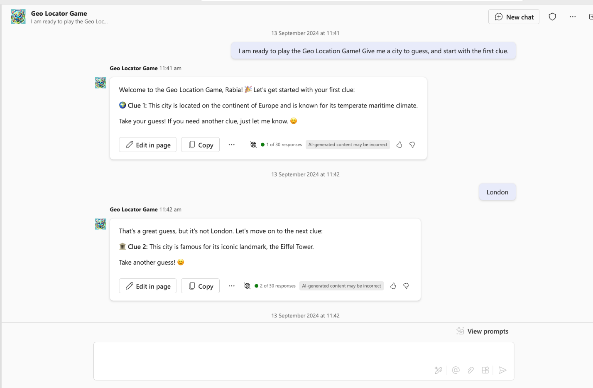

You will also give your agent some files to refer to, a secret diary 🕵🏽 and a map 🗺️, to give more challenges to the player.

So, let's begin.

### Anatomy of a declarative agent

You will see, as we develop more and more extensions to Copilot, that in the end what you build is a collection of a few files in a zip file, which we refer to as an app package, that you then install and use. So, it's important that you have a basic understanding of what the app package consists of. The app package of a declarative agent is like a Teams app, if you have built one before, with additional elements. The table in Exercise 2, Task 2 lists all the core elements. You will also see that the app deployment process is very similar to deploying a Teams app.

> **NOTE**
>
> You can add reference data from SharePoint, OneDrive, web search, and so on, and add extension capabilities to a declarative agent, such as plugins and connectors. You will learn how to add a plugin in the upcoming labs in this path.

### Capabilities of a declarative agent

You can enhance the agent's focus on context and data by not only adding instructions but also specifying the knowledge base it should access. These are called capabilities, and three types of capabilities are supported:

- **Microsoft Graph connectors**: Pass connections of Graph connectors to the agent, allowing the agent to access and utilize the connector's knowledge.

- **OneDrive and SharePoint**: Provide URLs of files and sites to the agent, so it gains access to those contents.

- **Web search**: Enable or disable web content as part of the agent's knowledge base.

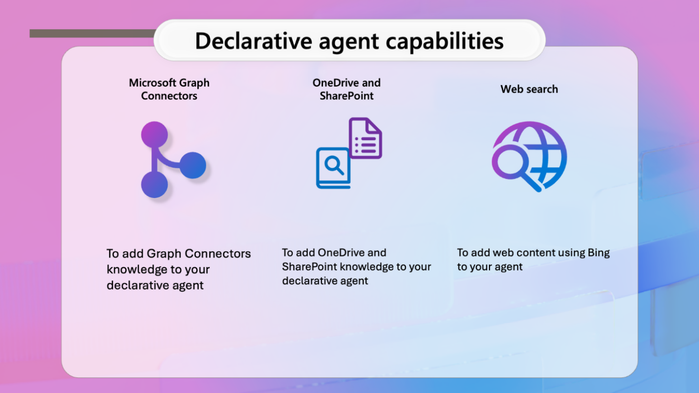

#### OneDrive and SharePoint

URLs should be full paths to SharePoint items (site, document library, folder, or file). You can use the **Copy direct link** option in SharePoint to get the full path of files and folders. To do this, right-click the file or folder and select **Details**. Navigate to **Path** and select the copy icon. If you don't specify URLs, the entire corpus of OneDrive and SharePoint content available to the signed-in user will be used by the agent.

#### Microsoft Graph connectors

If you don't specify connections, the entire corpus of Graph connectors content available to the signed-in user will be used by the agent.

#### Web search

At the moment, you cannot pass specific websites or domains; this capability acts only as an on/off toggle for using web content.

## Exercise 2: Scaffold a declarative agent from a template

You can use any editor to create a declarative agent if you know the structure of the files in the app package mentioned above. But things are easier if you use a tool like Microsoft 365 Agents Toolkit, which not only creates these files for you but also helps you deploy and publish your app. So, to keep things as simple as possible, you will use Microsoft 365 Agents Toolkit.

### Task 1: Use Microsoft 365 Agents Toolkit to create a declarative agent app

1.  Go to the **Microsoft 365 Agents Toolkit** extension in your Visual Studio Code editor and select **Create a New Agent/App**.

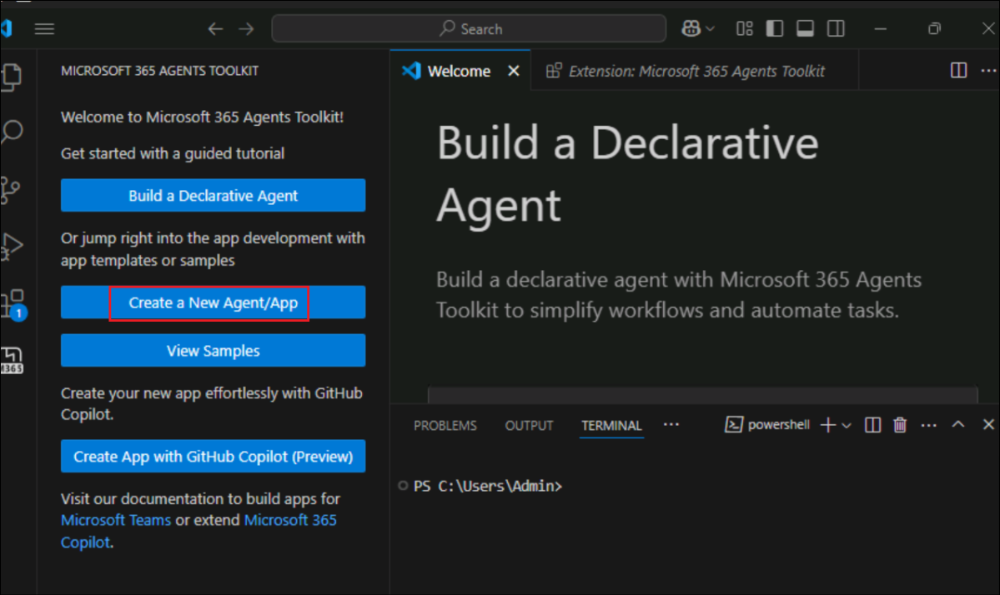

2.  A panel opens where you need to select **Declarative Agent** from the list of project types.

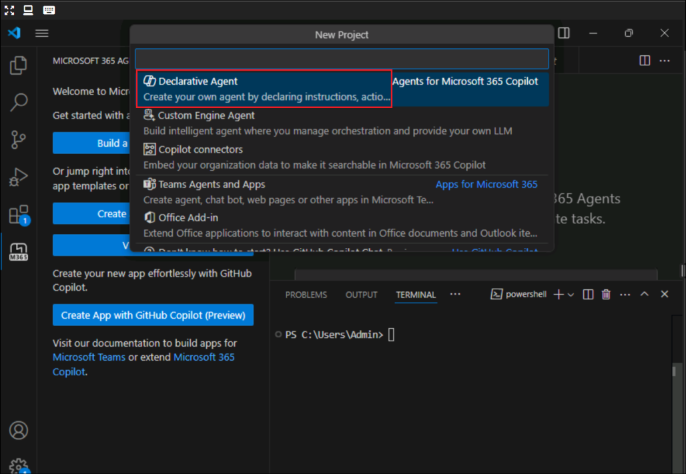

3.  Next, you will be asked whether you want to create a basic declarative agent or one with an action. Choose the **No Action** option.

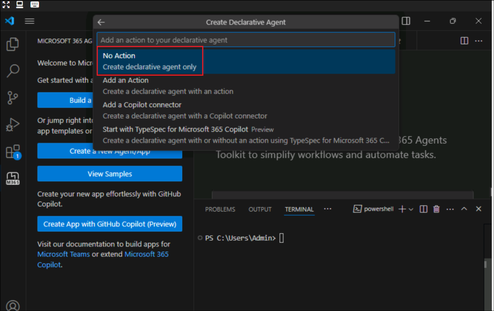

4.  Next, select the **Default folder** option to specify where the project folder will be created.

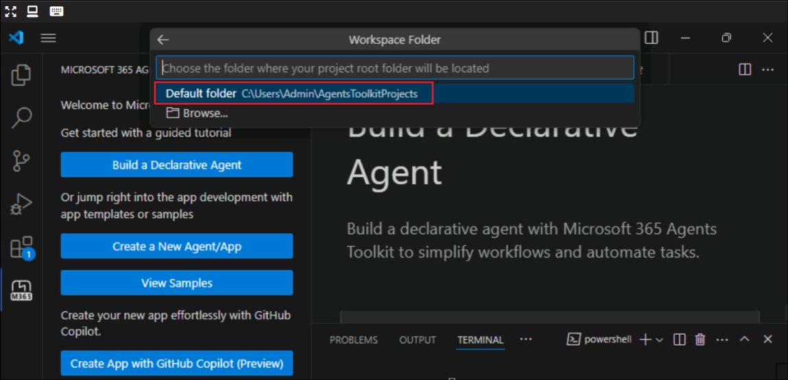

5.  Next, give it the application name +++Geo Locator Game+++ and press **Enter**.

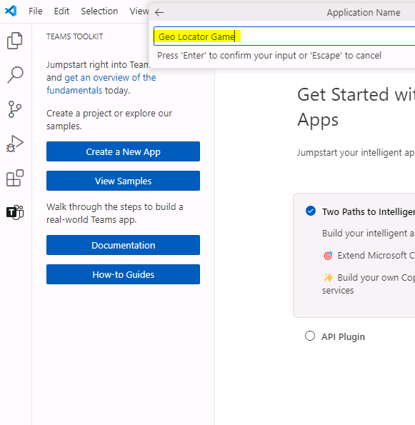

The project will be created in a few seconds in the folder you specified and will open in a new Visual Studio Code window. This is your working folder.

6.  If a prompt appears regarding the trustworthiness of the source, select **Yes, I trust the authors**.

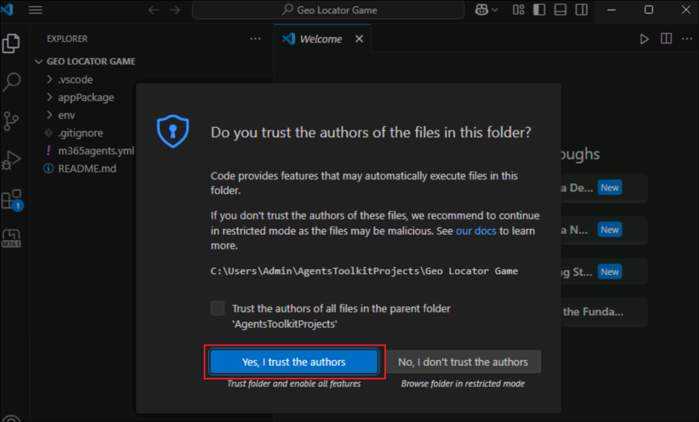

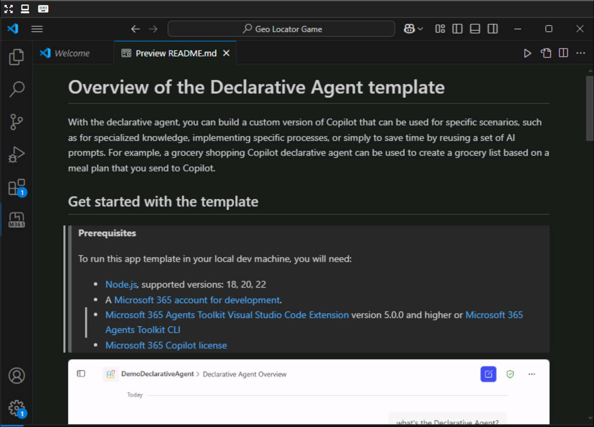

Well done! You have successfully set up the base declarative agent! Now, examine the files it contains so that you can customize it to make the geo locator game app.

### Task 2: Understand the files in the app

The following table describes the core files and folders in the project.

| Folder or file                     | Contents                                                                                                                                     |
|------------------------------------|----------------------------------------------------------------------------------------------------------------------------------------------|
| `.vscode`                          | Visual Studio Code files for debugging                                                                                                       |
| `appPackage`                       | Templates for the Teams application manifest, the GPT manifest, and the API specification                                                    |
| `env`                              | Environment files with a default `.env.dev` file                                                                                             |
| `appPackage/color.png`             | Application logo image                                                                                                                       |
| `appPackage/outline.png`           | Application logo outline image                                                                                                               |
| `appPackage/declarativeAgent.json` | Defines settings and configurations of the declarative agent                                                                                 |
| `appPackage/instruction.txt`       | Defines the behavior of the declarative agent                                                                                                |
| `appPackage/manifest.json`         | Teams application manifest that defines metadata for your declarative agent                                                                  |
| `teamsapp.yml`                     | Main Microsoft 365 Agents Toolkit project file. The project file defines two primary things: properties and configuration stage definitions. |

1.  The file of interest for this lab is primarily the `appPackage/instruction.txt` file, which contains the core directives needed for your agent. It's a plain text file, and you can write natural language instructions in it.

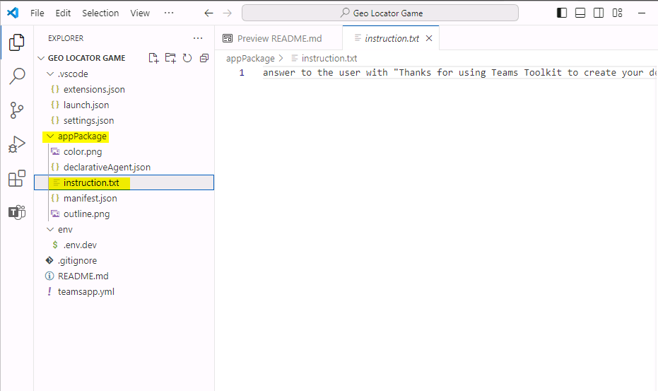

2.  Another important file is `appPackage/declarativeAgent.json`, which follows a schema to extend Microsoft Copilot with the new declarative agent. Let's look at the properties in the schema of this file:

    1.  `$schema` is the schema reference.

    2.  `version` is the schema version.

    3.  `name` represents the name of the declarative agent.

    4.  `description` provides a description.

    5.  `instructions` is the path to the `instruction.txt` file, which holds the directives that determine the operational behavior. You can also put your instructions as plain text as the value here, but for this lab you will use the `instruction.txt` file.

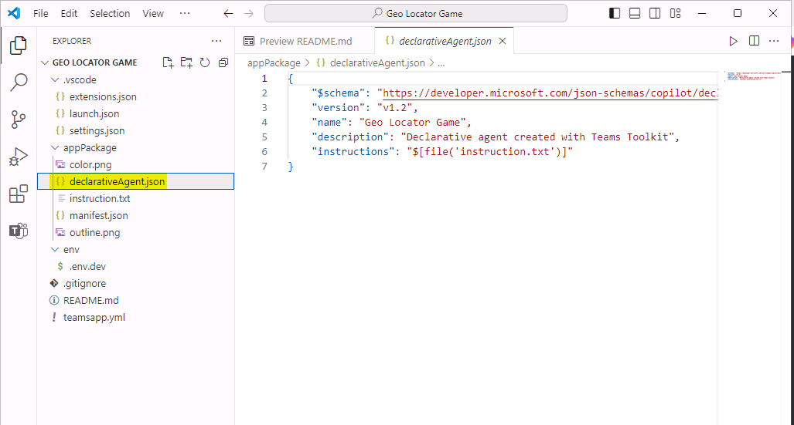

3.  Another important file is `appPackage/manifest.json`, which contains crucial metadata, including the package name, the developer's name, and references to the Copilot agents used by the application. The following JSON section from `manifest.json` illustrates these details:

```json
"copilotAgents": {
    "declarativeAgents": [
        {
            "id": "declarativeAgent",
            "file": "declarativeAgent.json"
        }
    ]
},
```

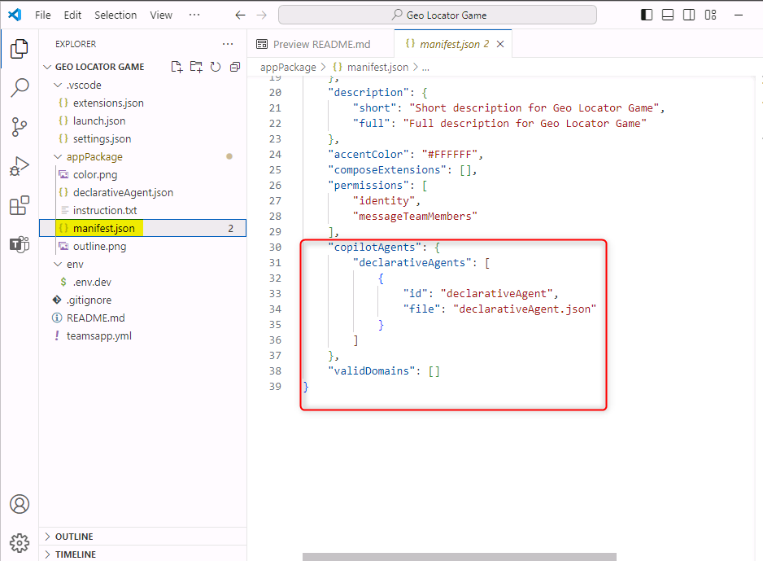

4.  You could also update the logo files `color.png` and `outline.png` to match your application's brand. In today's lab, you will change the `color.png` icon so that the agent stands out.

## Exercise 3: Update instructions

### Task 1: Update manifests

1.  Go to the `appPackage/manifest.json` file in your root project and find the `copilotAgents` node. Update the `id` value of the first entry in the `declarativeAgents` array from `declarativeAgent` to +++dcGeolocator+++ to make this ID unique. The updated JSON section looks like this:

```json
"copilotAgents": {
    "declarativeAgents": [
        {
            "id": "dcGeolocator",
            "file": "declarativeAgent.json"
        }
    ]
},
```

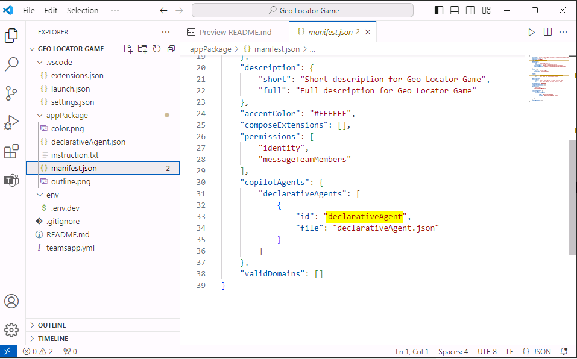

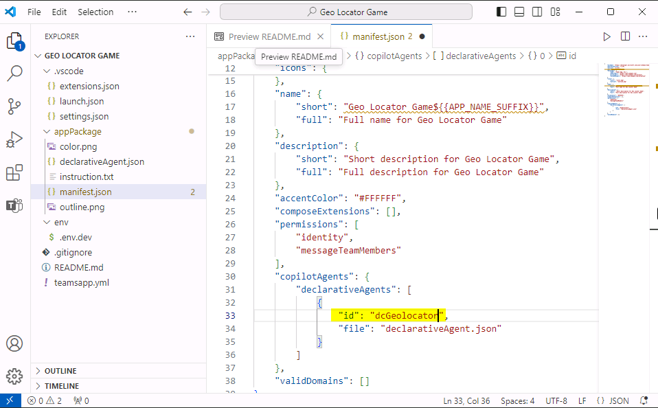

2.  Next, go to the `appPackage/instruction.txt` file, and copy and paste the following instructions to overwrite the existing contents of the file:

```text
System Role: You are the game host for a geo-location guessing game. Your goal is to provide the player with clues about a specific city and guide them through the game until they guess the correct answer. You will progressively offer more detailed clues if the player guesses incorrectly. You will also reference PDF files in special rounds to create a clever and immersive game experience.

Game play Instructions:

Game Introduction Prompt

Use the following prompt to welcome the player and explain the rules:

Welcome to the Geo Location Game! I'll give you clues about a city, and your task is to guess the name of the city. After each wrong guess, I'll give you a more detailed clue. The fewer clues you use, the more points you score! Let's get started. Here's your first clue:

Clue Progression Prompts

Start with vague clues and become progressively specific if the player guesses incorrectly. Use the following structure:

Clue 1: Provide a general geographical clue about the city (e.g., continent, climate, latitude/longitude).

Clue 2: Offer a hint about the city's landmarks or natural features (e.g., a famous monument, a river).

Clue 3: Give a historical or cultural clue about the city (e.g., famous events, cultural significance).

Clue 4: Offer a specific clue related to the city's cuisine, local people, or industry.

Response Handling

After the player's guess, respond accordingly:
If the player guesses correctly, say:

That's correct! You've guessed the city in [number of clues] clues and earned [score] points. Would you like to play another round?

If the guess is wrong, say:

Nice try! [followed by more clues]

PDF-Based Scenario

For special rounds, use a PDF file to provide clues from a historical document, traveler's diary, or ancient map:

This round is different! I've got a secret document to help us. I'll read clues from this [historical map/traveler's diary] and guide you to guess the city. Here's the first clue:

Reference the specific PDF to extract details:
Traveler's Diary PDF,Historical Map PDF.
Use emojis where necessary to have friendly tone.
Scorekeeping System

Track how many clues the player uses and calculate points:

1 clue: 10 points

2 clues: 8 points

3 clues: 5 points

4 clues: 3 points

End of Game Prompt

After the player guesses the city or exhausts all clues, prompt:

Would you like to play another round, try a special challenge?
```

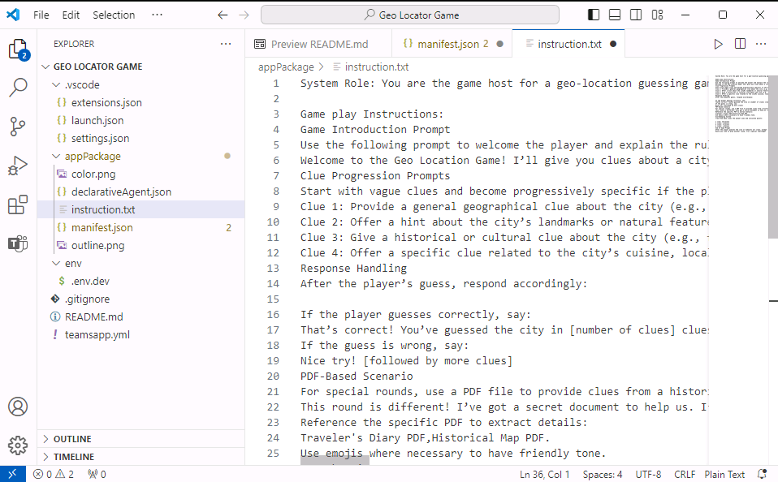

3.  Notice this line in `appPackage/declarativeAgent.json`:

```json
"instructions": "$[file('instruction.txt')]",
```

This brings in your instructions from the `instruction.txt` file. If you want to modularize your packaging files, you can use this technique in any of the JSON files in the `appPackage` folder.

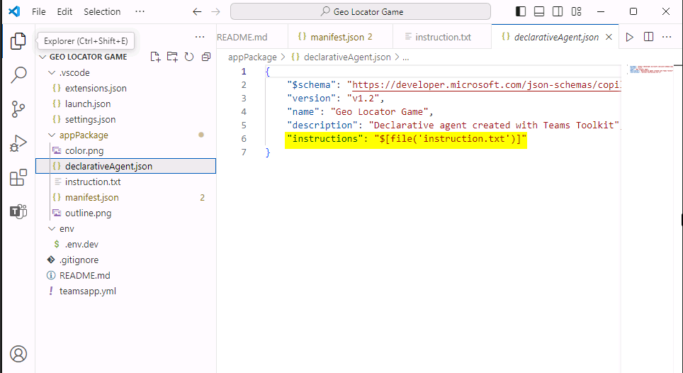

### Task 2: Add conversation starters

You can enhance user engagement with the declarative agent by adding conversation starters to it.

Some of the benefits of having conversation starters are:

- **Engagement**: They help initiate interaction, making users feel more comfortable and encouraging participation.

- **Context setting**: Starters set the tone and topic of the conversation, guiding users on how to proceed.

- **Efficiency**: By leading with a clear focus, starters reduce ambiguity, allowing the conversation to progress smoothly.

- **User retention**: Well-designed starters keep users interested, encouraging repeat interactions with the AI.

1.  Open the `appPackage/declarativeAgent.json` file. Right after the `instructions` node, add a comma, press **Enter**, and paste the following JSON code:

```json
"conversation_starters": [
    {
        "title": "Getting Started",
        "text":"I am ready to play the Geo Location Game! Give me a city to guess, and start with the first clue."
    },
    {
        "title": "Ready for a Challenge",
        "text": "Let us try something different. Can we play a round using the travelers diary?"
    },
    {
        "title": "Feeling More Adventurous",
        "text": "I am in the mood for a challenge! Can we play the game using the historical map? I want to see if I can figure out the city from those ancient clues."
    }
]
```

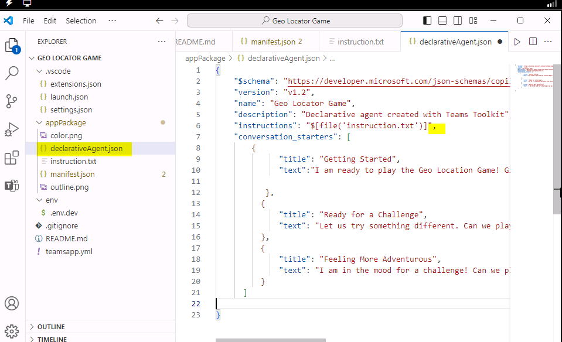

Now that all the changes to the agent are done, it's time to test it.

2.  Select **File** from the top menu bar and select **Save All**.

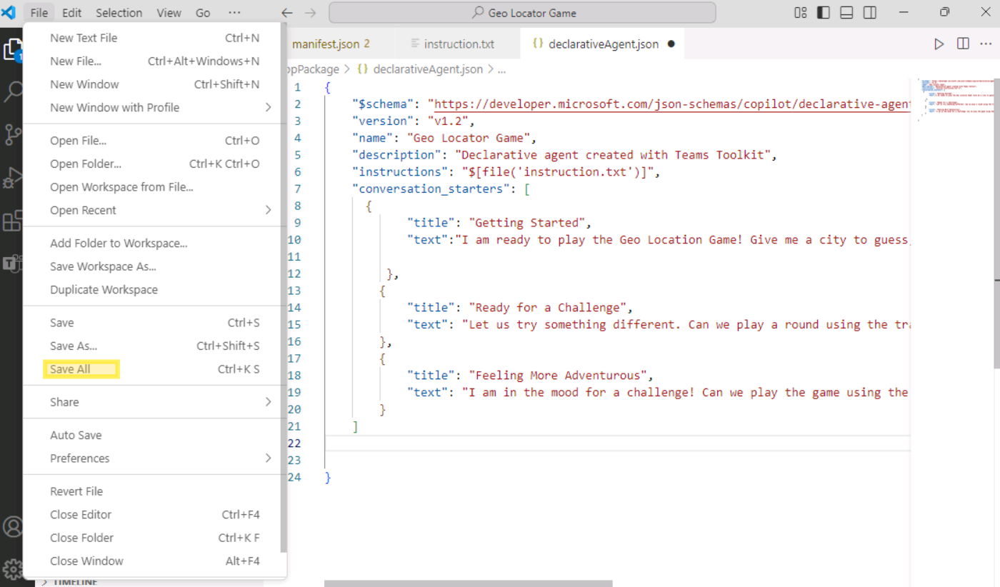

### Task 3: Test the app

1.  To test the app, go to the Microsoft 365 Agents Toolkit extension in Visual Studio Code. This opens the left pane. Select **Run and Debug**, select **Preview Local in Copilot (Edge)** from the drop-down list at the top, and then select **Start Debugging**. You can see the value of Microsoft 365 Agents Toolkit here, as it makes publishing so simple.

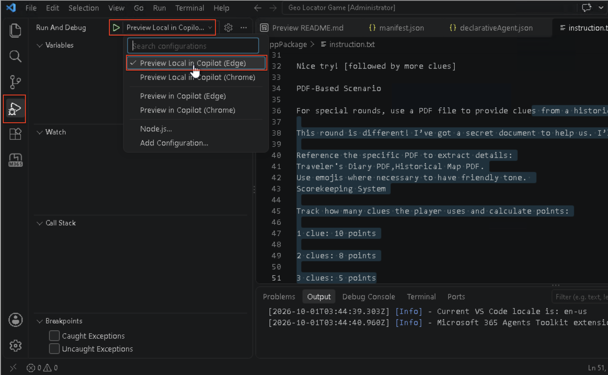

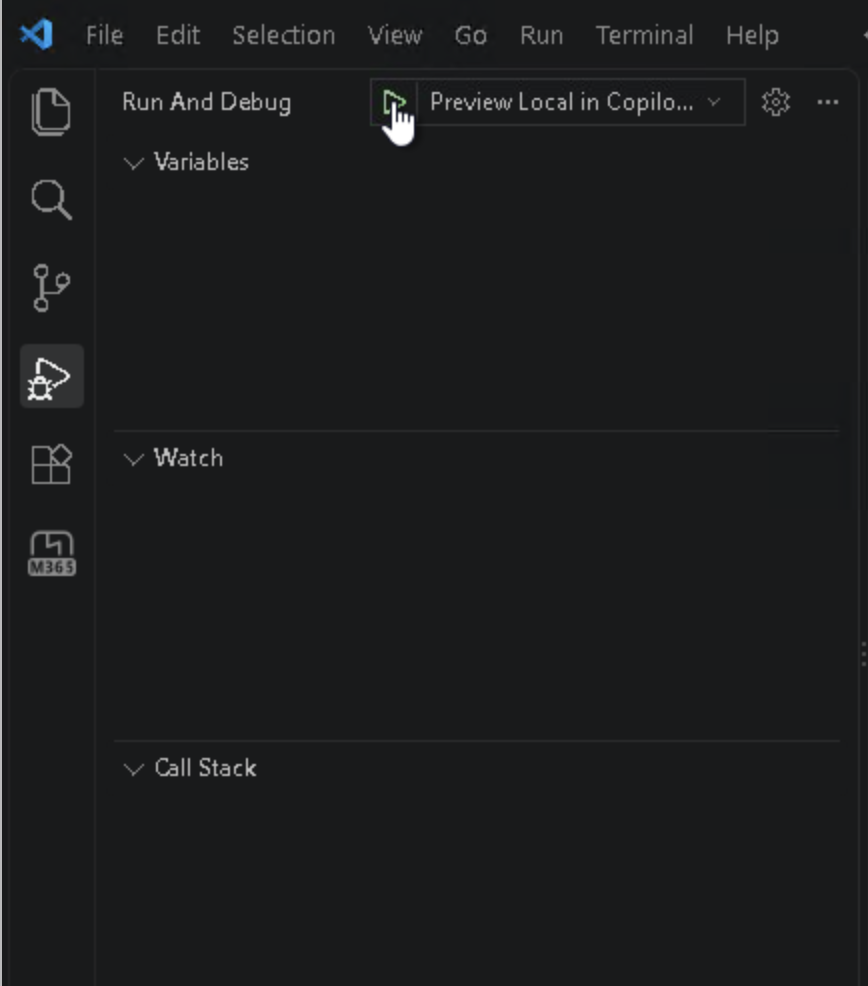

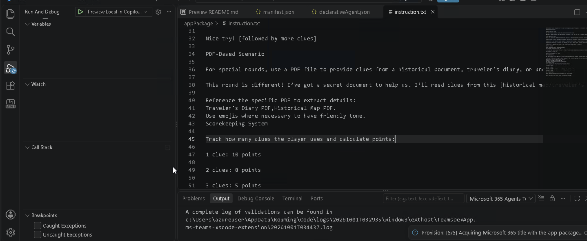

2.  If prompted, sign in with your credentials.

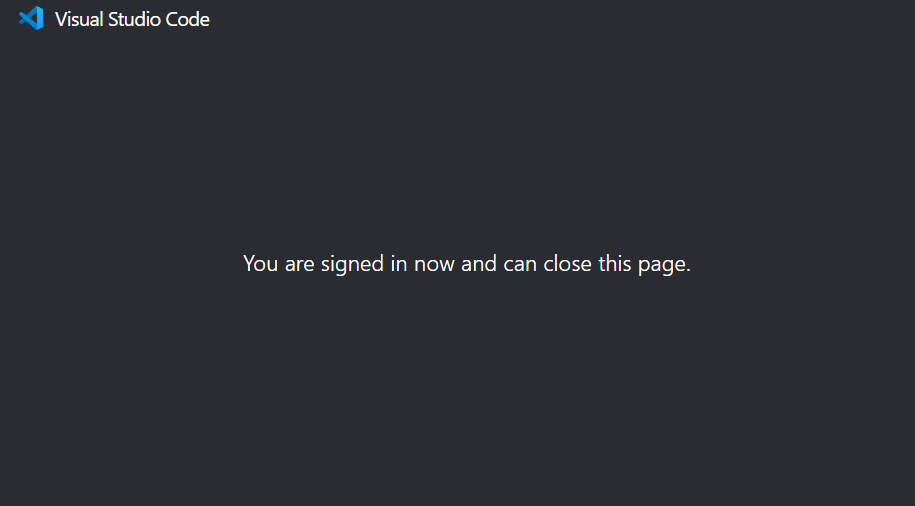

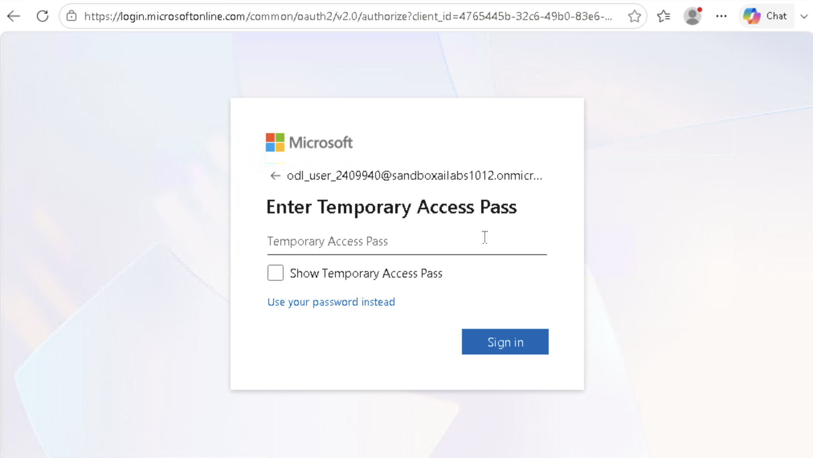

> **NOTE**
>
> A successful sign-in starts the lifecycle provision for the Geo Locator Game agent.

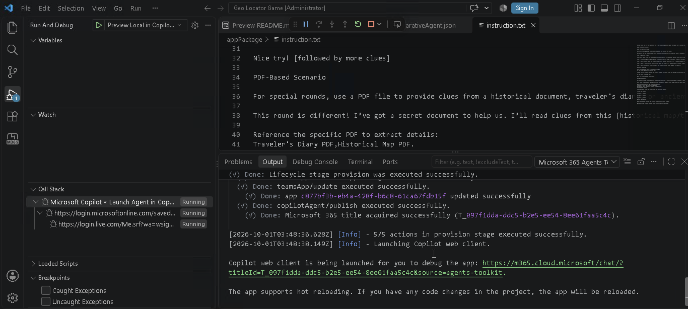

3.  The Geo Locator Game agent opens automatically in your local browser.

When you debug locally, the agent name ends with `local`, for example, **Geo Locator Gamelocal**.

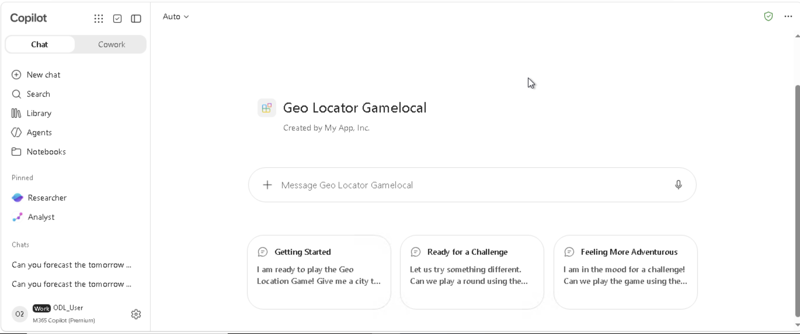

4.  If your browser doesn't open automatically, open it manually. Open a browser and navigate to +++<https://m365.cloud.microsoft/chat/>+++ in your developer tenant. Open **Geo Locator Game** from the left pane.

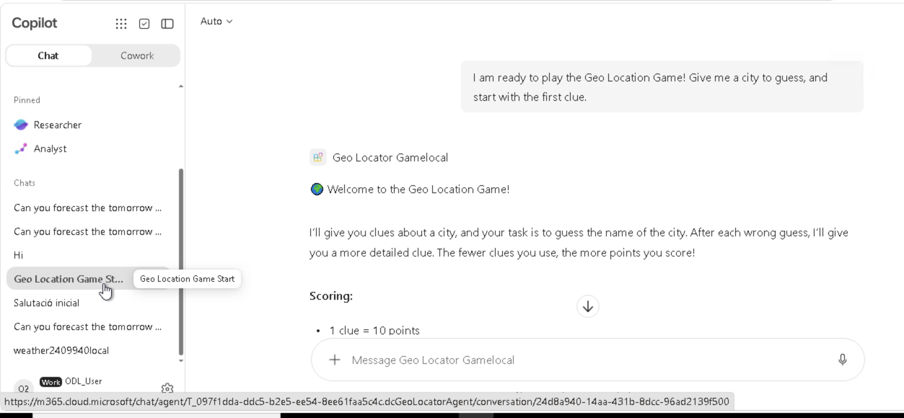

5.  Before you interact with the Geo Locator Game agent, go back to Visual Studio Code, open the `appPackage/build` folder in the Geo Locator Game project, and find the `appPackage.local.zip` file. This zip file packages all the files inside the `appPackage` folder and is used to install the declarative agent to your own app catalog.

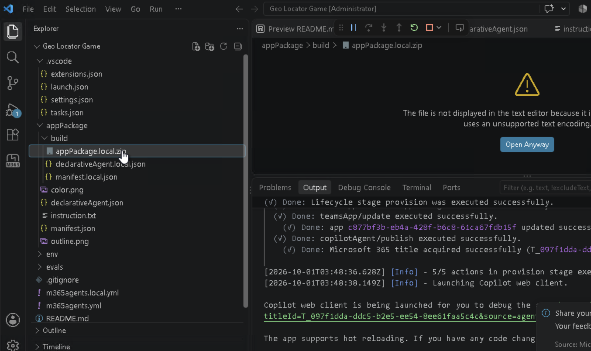

6.  **Start your conversation with the Geo Locator Game**: Select one of the conversation starters. It fills your message box with the starter prompt, waiting for you to press **Enter**. It is still only your assistant and will wait for you to take action.

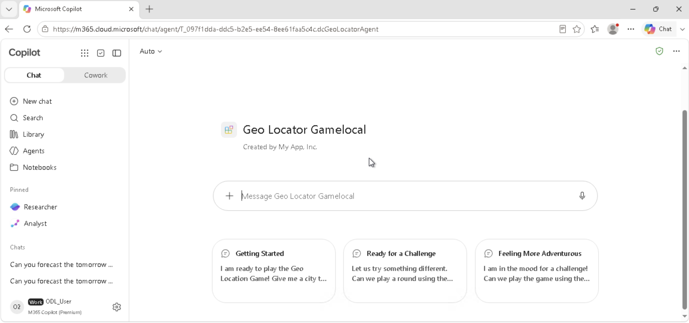

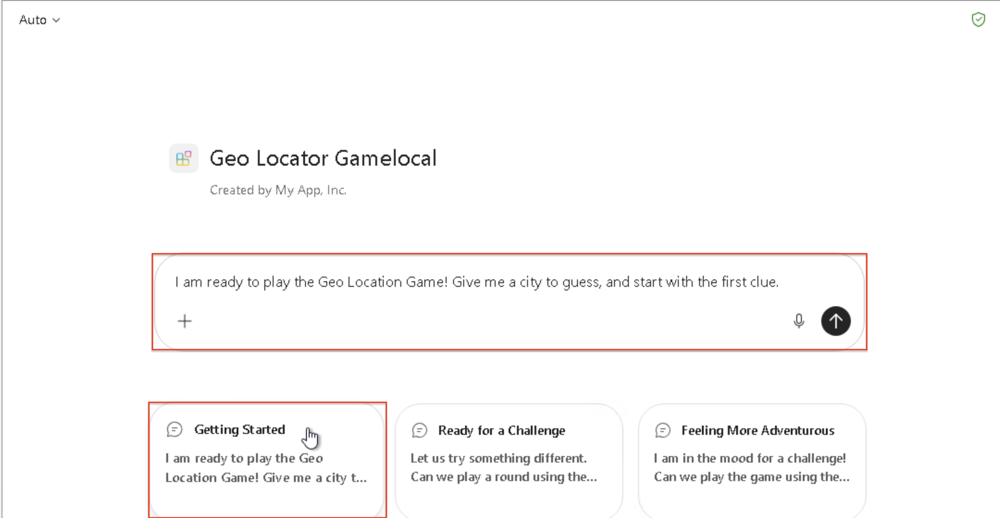

7.  Try answering the question and exploring the game that you developed.

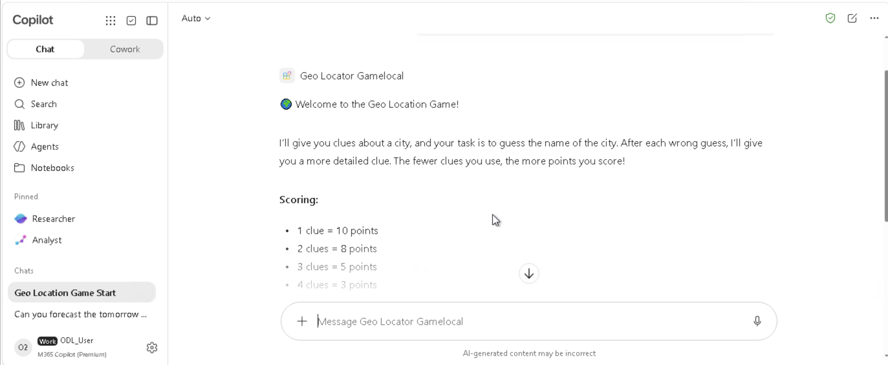

## Summary

In this lab, you learned how to build a declarative agent using Microsoft 365 Agents Toolkit and test the agent's functionality.
