# Lab 8: Transform after-sales repair operations at Zava Retail with an AI-powered declarative agent

## Objective

In this lab, you will build a declarative agent with a TypeSpec definition using Microsoft 365 Agents Toolkit. You will create an agent called RepairServiceAgent, which interacts with repairs data via an existing API service to help users manage car repair records.

## Declarative agents

**Declarative agents** are a type of agent for Microsoft 365. You can build one by extending Microsoft 365 Copilot. You define custom knowledge and custom actions to create agents tailored to a specific scenario.

Declarative agents use the same infrastructure, orchestrator, foundation model, and security controls as Microsoft 365 Copilot, which ensures a consistent and familiar user experience.


### Significance of TypeSpec for declarative agents

#### What is TypeSpec

TypeSpec is a language developed by Microsoft for designing and describing API contracts in a structured and type-safe way. Think of it as a blueprint for how an API should look and behave, including what data it accepts and returns, and how different parts of the API and its actions are connected.

#### Why TypeSpec for agents?

If you like how TypeScript enforces structure in your frontend and backend code, you'll love how TypeSpec enforces structure in your agent and its API services, such as actions. It fits perfectly in design-first development workflows that align with tools like Visual Studio Code.

- **Clear communication**: Provides a single source of truth that defines how your agent should behave, avoiding confusion when dealing with multiple manifest files, as in the case of declarative agents.

- **Consistency**: Ensures that all parts of your agent and its actions, capabilities, and so on are designed consistently, following the same pattern.

- **Automation friendly**: Automatically generates OpenAPI specs and other manifests, saving time and reducing human errors.

- **Early validation**: Catches design issues early, before you write actual code, for example, mismatched data types or unclear definitions.

- **Design-first approach**: Encourages thinking about agent and API structure and contracts before jumping into implementation, leading to better long-term maintainability.

## Exercise 1: Set up the lab environment

In this exercise, you will set up the development environment to build, test, and deploy Copilot agents that help you achieve tailor-made AI assistance using Microsoft 365 Copilot.

### Task 1: Install Agents Toolkit

**Microsoft 365 Agents Toolkit** requires Visual Studio Code. In this task, you will install the toolkit in Visual Studio Code.

1.  Open **Visual Studio Code** from the VM. Select **Extensions** from the left menu.

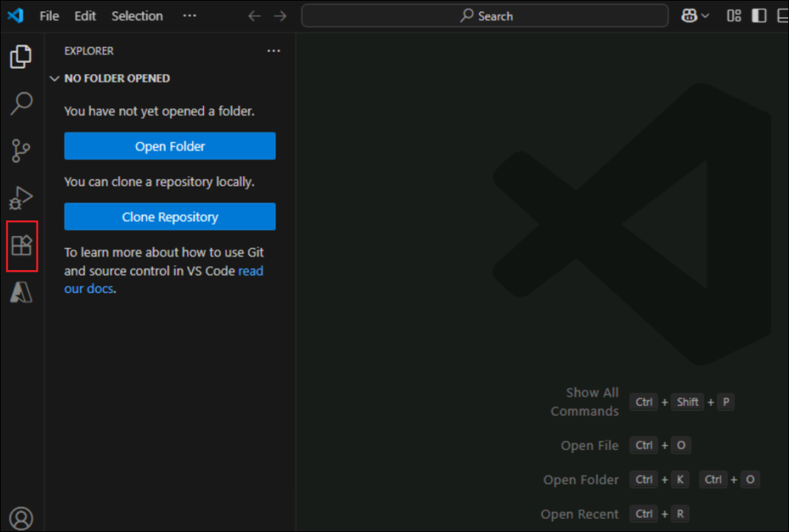

2.  Search for and select +++Microsoft 365 Agents Toolkit+++, and then select **Install**.

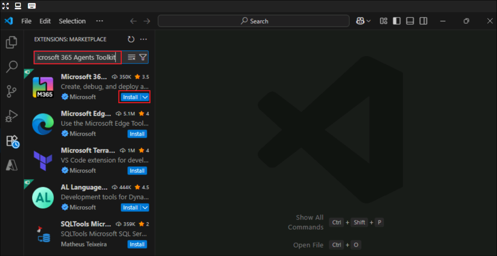

3.  Ensure that the toolkit is installed.

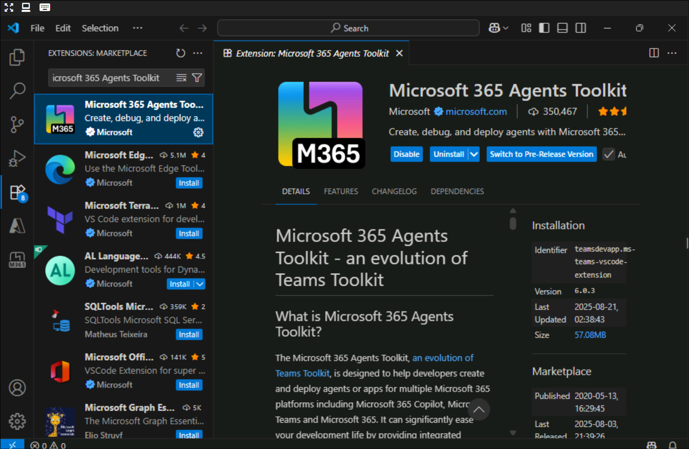

4.  Create a new folder named +++ServiceAgent+++ on your Desktop.

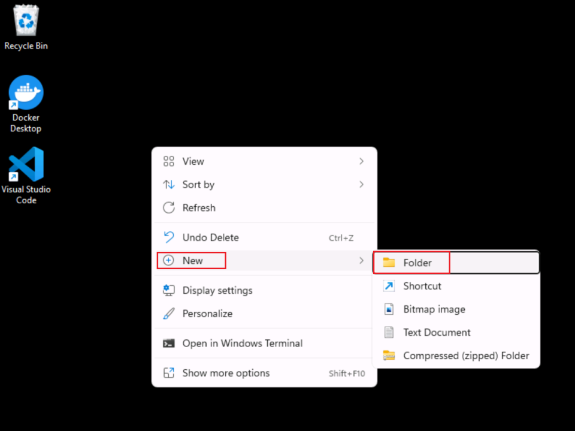

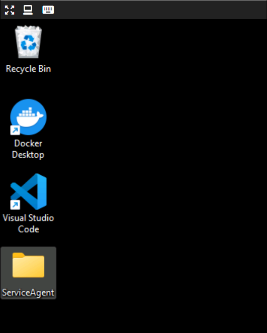

## Exercise 2: Build the base agent with TypeSpec using Microsoft 365 Agents Toolkit

In this exercise, you will build a **declarative agent**, define it, update the actions, and test the agent.

### Task 1: Scaffold your base agent project using Microsoft 365 Agents Toolkit

In this task, you will build the **declarative agent** with a **TypeSpec** definition using **Microsoft 365 Agents Toolkit**. You will create an agent called **RepairServiceAgent**, which interacts with repairs data via an existing API service to help users manage car repair records.

1.  Locate the **Microsoft 365 Agents Toolkit** icon  in the Visual Studio Code menu on the left and select it. An activity bar opens. Select the **Create a New Agent/App** button in the activity bar, which opens the palette with a list of app templates available in Microsoft 365 Agents Toolkit.

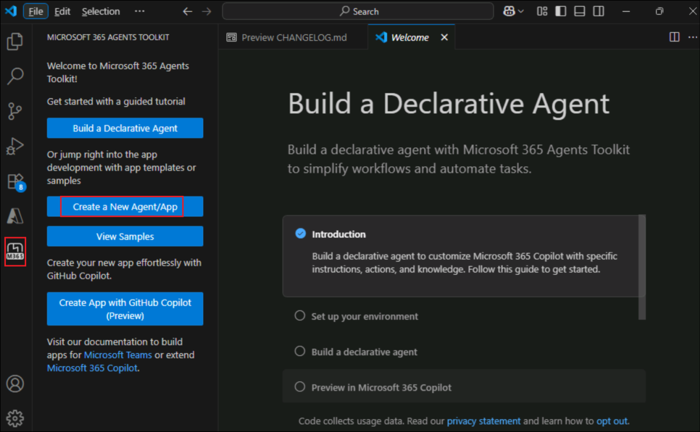

2.  Choose **Declarative Agent** from the list of templates.

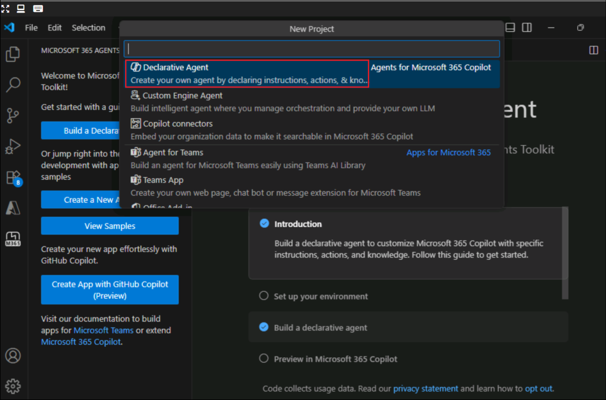

3.  Next, select **Start with TypeSpec for Microsoft 365 Copilot** to define your agent using TypeSpec.

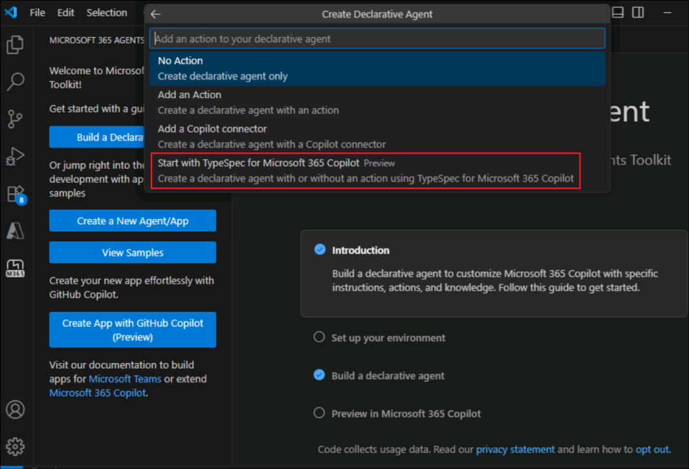

4.  Next, select **Browse**, and then select the **ServiceAgent** folder on the Desktop. This is the location where you want the toolkit to scaffold the agent project.

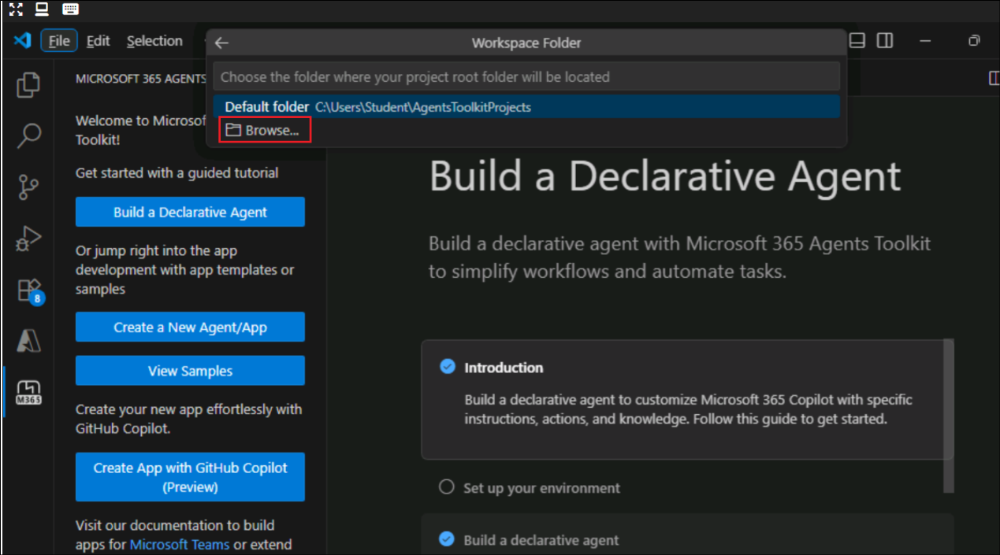

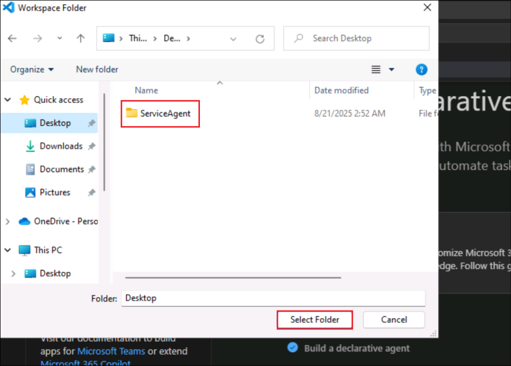

5.  Next, enter the application name +++RepairServiceAgent+++ and press **Enter** to complete the process. A new Visual Studio Code window opens with the agent project preloaded.

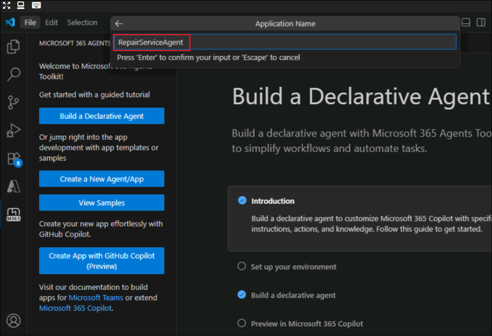

6.  Select the **Yes, I trust the authors** option in the confirmation dialog.

You'll need to sign in to **Microsoft 365 Agents Toolkit** to upload and test your agent from within it.

7.  Within the project window, select the **Microsoft 365 Agents Toolkit** icon  again from the left menu. This opens the toolkit's activity bar with sections such as **Accounts**, **Environment**, and **Development**.

8.  Under the **Accounts** section, select **Sign in to Microsoft 365**.

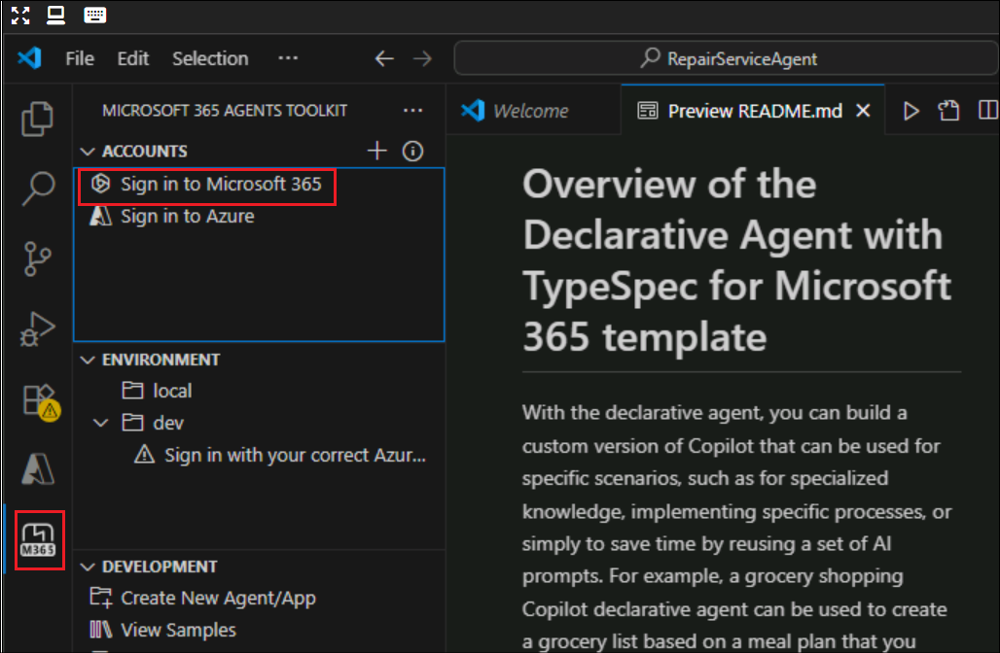

9.  A dialog opens in the editor with the options to sign in, create a Microsoft 365 developer sandbox, or cancel. Select **Sign in**.

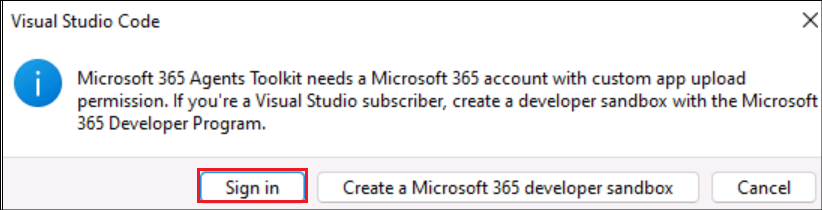

10. Sign in with the **user name** and **TAP Token** from the **Resources** tab.

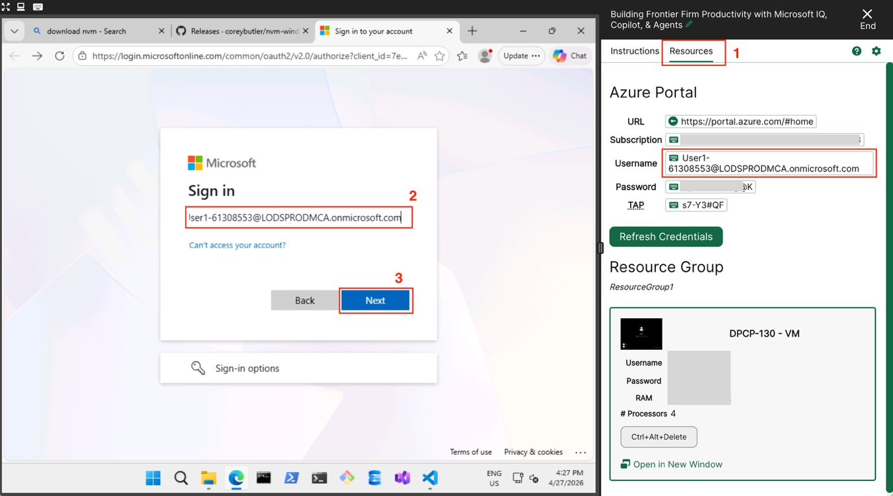

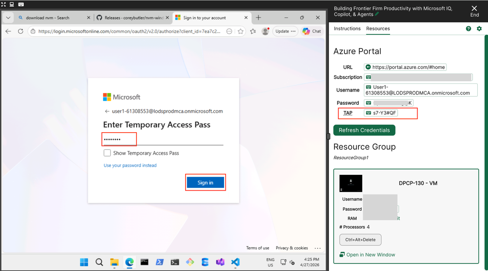

11. Once signed in, **close** the browser and go back to the project window.

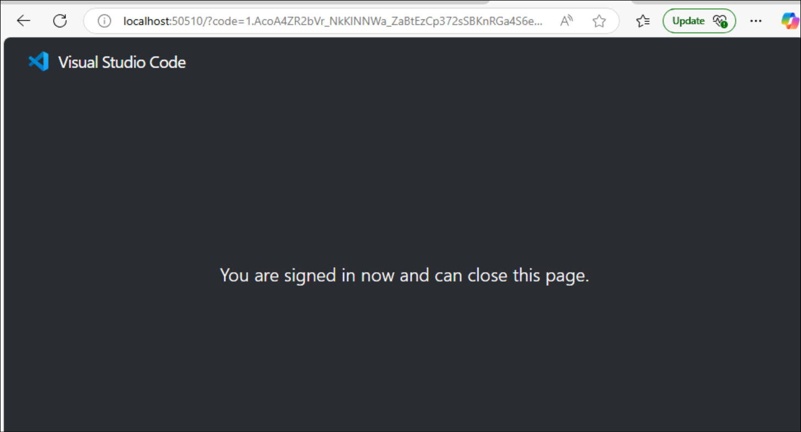

> **NOTE**
>
> If there is a message about **Custom App Upload Disabled**, you can safely ignore it.

### Task 2: Define your agent

The declarative agent project scaffolded by Agents Toolkit provides a template that includes code for connecting an agent to the GitHub API to display repository issues. In this lab, you'll build your own agent that integrates with a car repair service, supporting multiple operations to manage repair data.

Before proceeding with the agent definition, take a moment to examine the Repairs API service to gain a clearer understanding of its functionality.

#### Get to know the repair API service

You'll explore the endpoints and payloads of the API service interactively. Using an `.http` file in Visual Studio Code with the REST Client extension, which is already installed for you, allows you to define and send HTTP requests directly from your editor. It's a lightweight, code-friendly way to test APIs, inspect responses, and iterate quickly without switching to external tools.

1.  Inside the root folder of the project you just created, create a folder named +++http+++. Create a new file named +++repairs-api.http+++ inside the `http` folder.

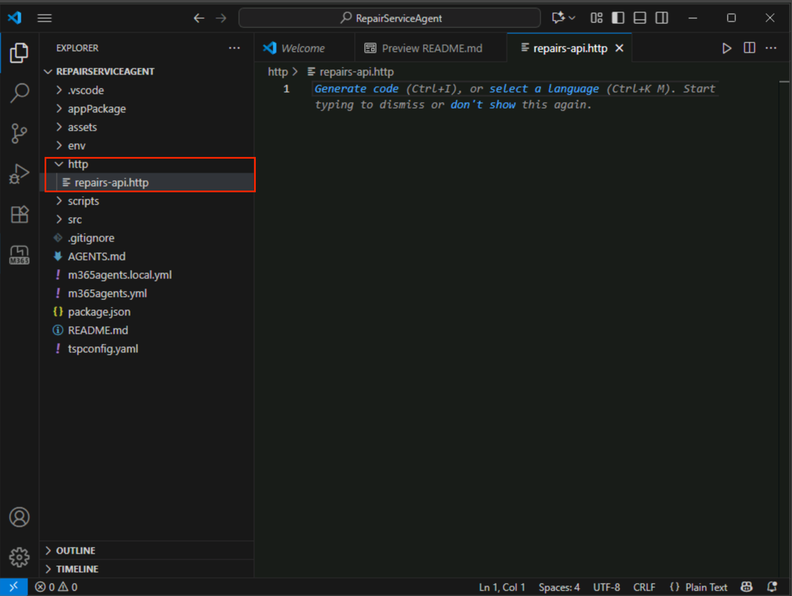

2.  Copy and paste the following content into the file:

```http
@base_url = https://repairshub.azurewebsites.net

### Get all repair requests
{{base_url}}/repairs

### Get a specific repair request by ID
{{base_url}}/repairs/1

### Create a new repair request
POST {{base_url}}/repairs
Content-Type: application/json

{
  "description": "Repair broken screen",
  "date": "2023-10-01T12:00:00Z",
  "image": "https://example.com/image.png"
}

### Update an existing repair request
PATCH {{base_url}}/repairs/1
Content-Type: application/json

{
  "id": 1,
  "description": "Repair broken screen - updated",
  "date": "2023-10-01T12:00:00Z",
  "image": "https://example.com/image-updated.png"
}


### Delete a repair request by ID
DELETE {{base_url}}/repairs/10
Content-Type: application/json

{
  "id": 10
}
```

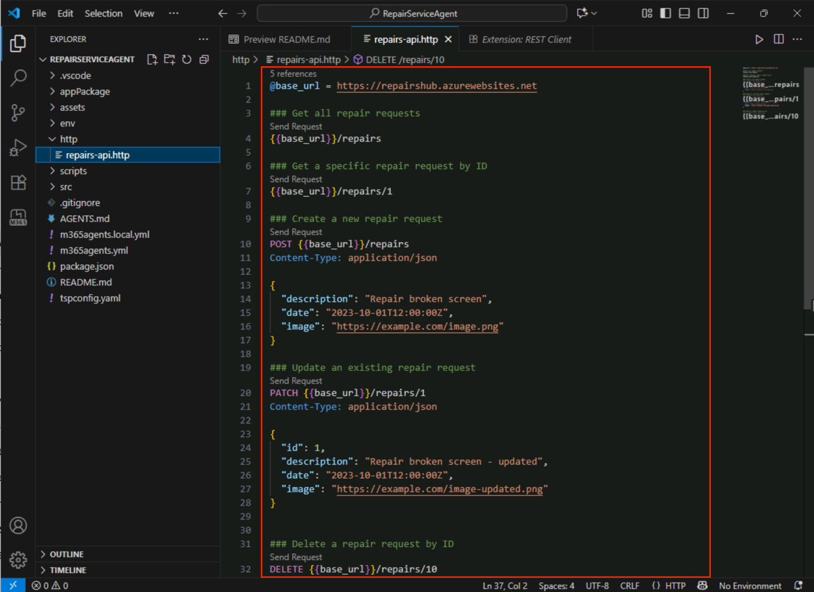

3.  To run each request, hover over each request line (for example, `GET {{base_url}}/repairs`) and select **Send Request** to see the response. Observe the structure of requests and responses, and use the response data to understand how your agent will interact with the API.

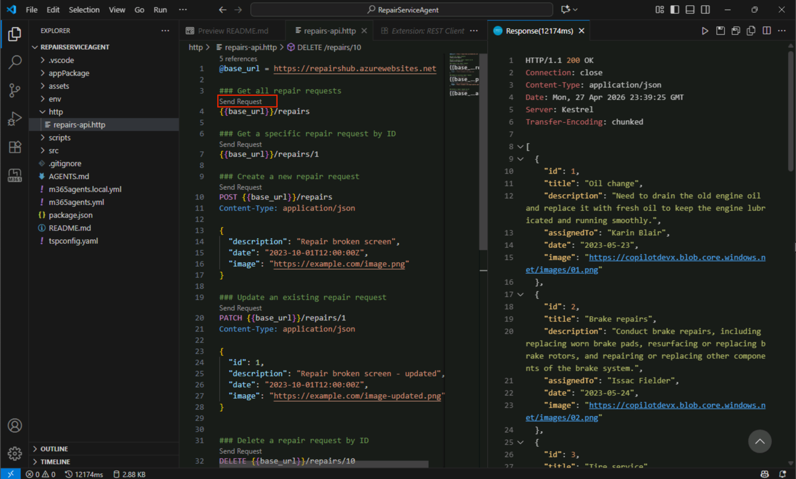

#### Repairs API overview

**Base URL**: `https://repairshub.azurewebsites.net`

| Operation               | Method   | Endpoint        | Payload required | Purpose                       |
|-------------------------|----------|-----------------|------------------|-------------------------------|
| Get all repair requests | `GET`    | `/repairs`      | No               | Retrieve all repair jobs      |
| Get repair by ID        | `GET`    | `/repairs/{id}` | No               | Fetch a specific repair job   |
| Create a repair request | `POST`   | `/repairs`      | Yes              | Submit a new repair job       |
| Update a repair request | `PATCH`  | `/repairs/{id}` | Yes              | Modify an existing repair job |
| Delete a repair request | `DELETE` | `/repairs/{id}` | No               | Remove a repair job by ID     |

Now that you're familiar with the API service, let's move on to integrating it with your agent.

#### Project structure

Within your agent project, under the `src/agent` folder, you'll find the core TypeSpec configuration files: `main.tsp` and `env.tsp`.

- The `main.tsp` file serves as the primary definition point for your agent, containing essential metadata, behavioral instructions, and capability specifications.

- The `env.tsp` file is used by the toolkit to process environment variables during compilation. This file is generated from the `env/.env.*` files and offers variables for other TypeSpec files, so manual updates are not required.

- The `actions` folder contains template files, initially including `github.tsp`, which demonstrates GitHub API integration. For this lab, you'll replace this template with your own action definitions to establish connectivity with the Repairs API service.

- The `prompts` folder contains the `instructions.tsp` file, which allows you to define detailed behavioral instructions and guidance for your agent.

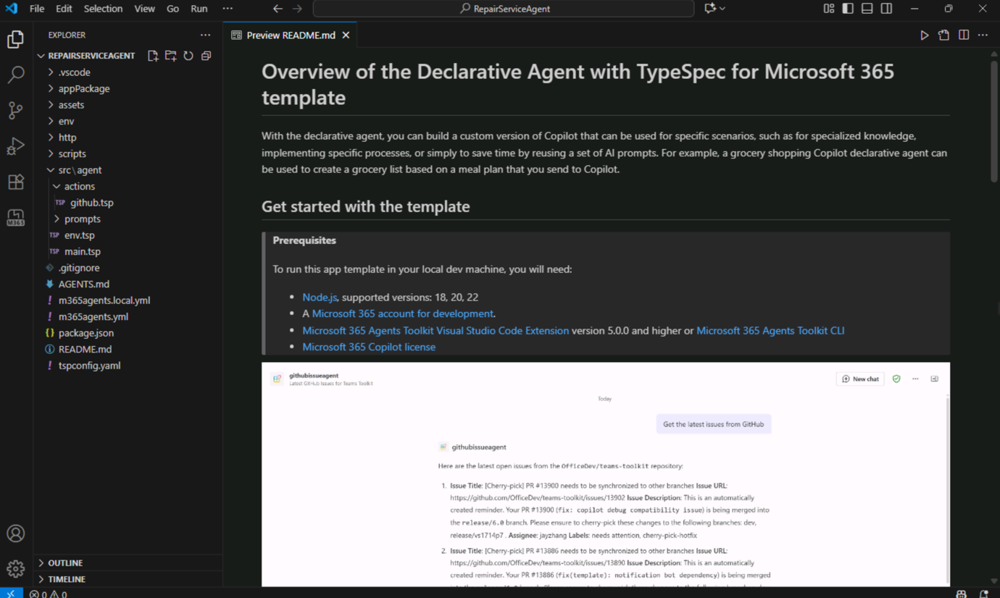

#### Update the agent metadata and instructions

In the `main.tsp` file, you will find the basic structure of the agent. Review the content provided by the toolkit template, which includes:

- **Agent name** and **description** 1️⃣

- Basic **instructions** 2️⃣

- Placeholder code for **actions** and **capabilities** (commented out) 3️⃣

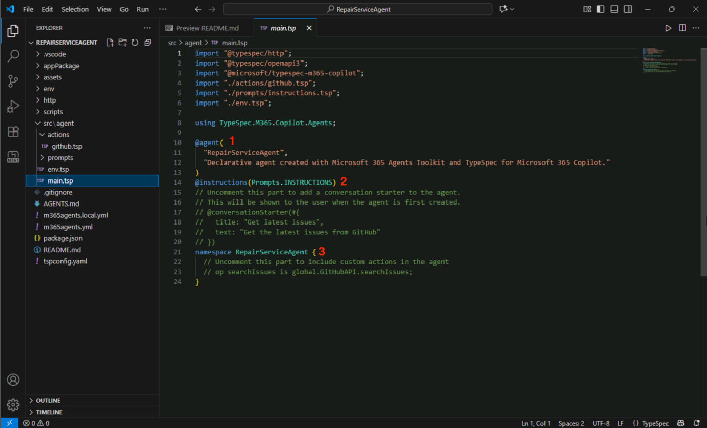

1.  Begin by defining your agent for the repair scenario. Replace the `@agent` metadata with the following code snippet:

```typespec
@agent(
  "RepairServiceAgent",
  "An agent for managing repair information"
)
```

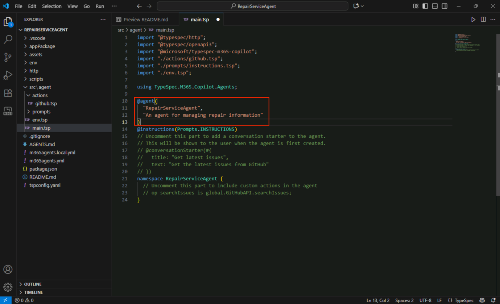

2.  Next, configure a conversation starter, the initial prompt that begins the user-agent interaction. Uncomment the default template section and update the `title` and `text` fields to match the agent scenario:

```typespec
// Uncomment this part to add a conversation starter to the agent.
// This will be shown to the user when the agent is first created.
@conversationStarter(#{
  title: "List repairs",
  text: "List all repairs"
})
```

This starter prompt needs to trigger a `GET` operation to retrieve all repairs from the service. To enable this behavior in the agent, you'll need to define the corresponding action, which you do in the next task.

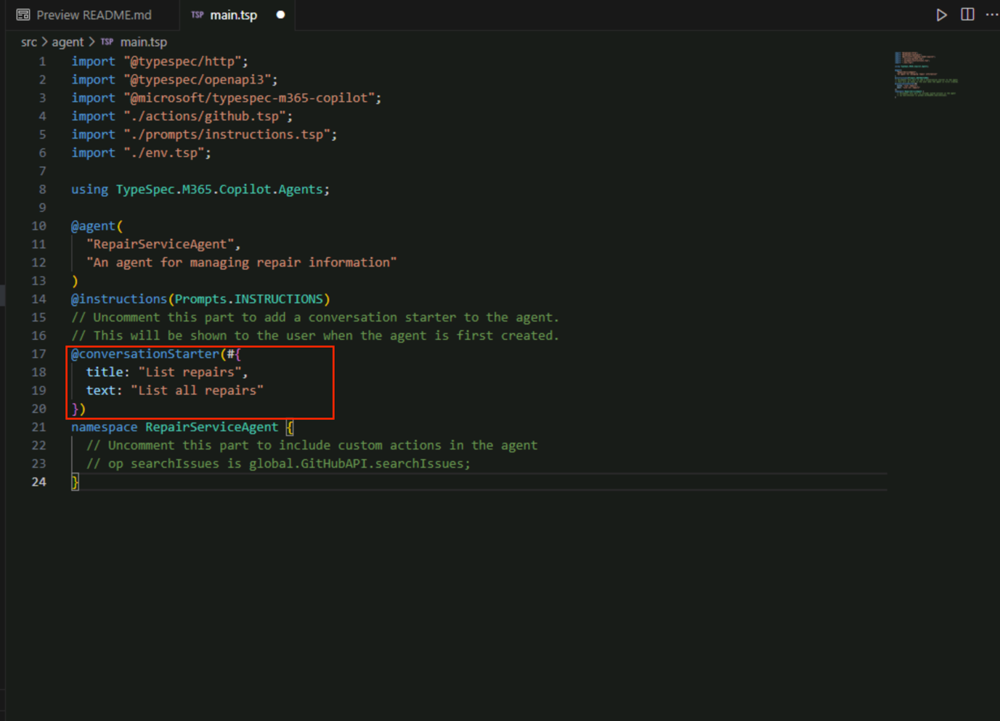

3.  Next, go to `prompts/instructions.tsp` and update the instructions. Replace the entire code block in the file with the following code:

```typespec
namespace Prompts {
  const INSTRUCTIONS = """
    ## Purpose
    You will assist the user in finding car repair records based on the information provided by the user.
  """;
}
```

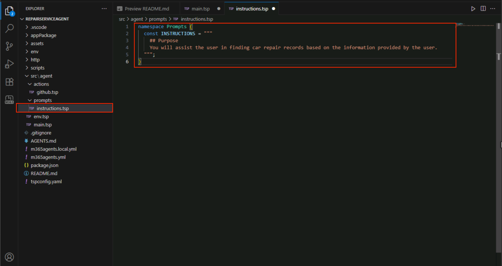

4.  Save the changes to both files using **CTRL+S**.

### Task 3: Update the action for the agent

1.  Open the `actions/github.tsp` file to define the action for your agent, and rename the file to +++actions.tsp+++.

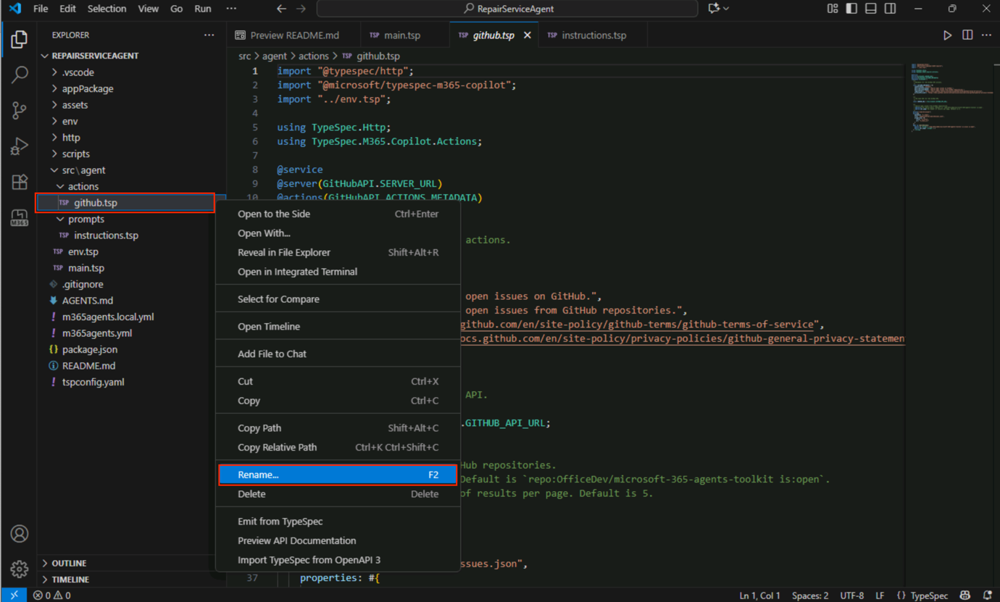

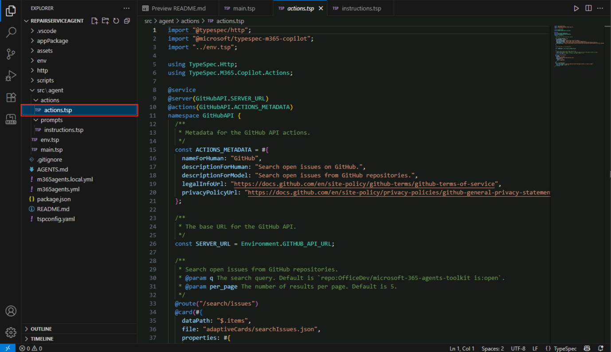

You'll return to the `main.tsp` file later to complete the agent metadata with the action reference, but first, the action itself must be defined.

2.  Open the `actions.tsp` file. The default template demonstrates how to define an agent action, including metadata, service URL, and operation structure. You will replace the sample GitHub logic entirely with definitions relevant to the Repairs API service.

3.  After the module-level directives, such as the `import` and `using` statements, replace the existing code up to the point where `SERVER_URL` is defined with the following snippet:

```typespec
@service
@server(RepairsAPI.SERVER_URL)
@actions(RepairsAPI.ACTIONS_METADATA)
namespace RepairsAPI{
  /**
   * Metadata for the API actions.
   */
  const ACTIONS_METADATA = #{
    nameForHuman: "Repair Service Agent",
    descriptionForHuman: "Manage your repairs and maintenance tasks.",
    descriptionForModel: "Plugin to add, update, remove, and view repair objects.",
    legalInfoUrl: "https://docs.github.com/en/site-policy/github-terms/github-terms-of-service",
    privacyPolicyUrl: "https://docs.github.com/en/site-policy/privacy-policies/github-general-privacy-statement"
  };

  /**
   * The base URL for the API.
   */
  const SERVER_URL = "https://repairshub.azurewebsites.net";
```

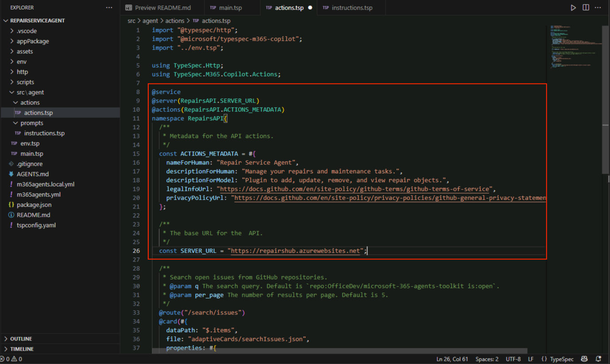

4.  Next, replace the operation in the template code from `searchIssues` to `listRepairs`, which is a repair operation to get the list of **repairs**. Replace the entire block of code starting just after the `SERVER_URL` definition and ending \*before\* the final closing brace with the following snippet. Be sure to leave the closing brace intact (lines 27 to 37).

```typespec
  /**
   * List repairs from the API
   * @param assignedTo The user assigned to a repair item.
   */

  @route("/repairs")
  @get op listRepairs(@query assignedTo?: string): string;
```

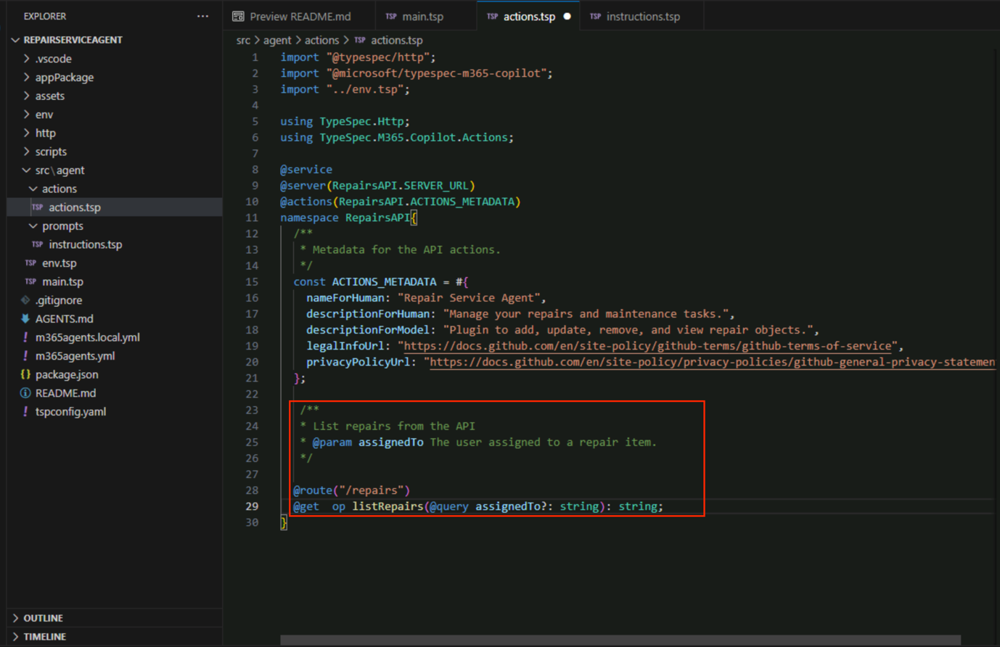

5.  Now go back to the `main.tsp` file and verify the import statement for actions. If it still references `./actions/github.tsp`, replace `import "./actions/github.tsp";` with the following statement:

```typespec
import "./actions/actions.tsp";
```

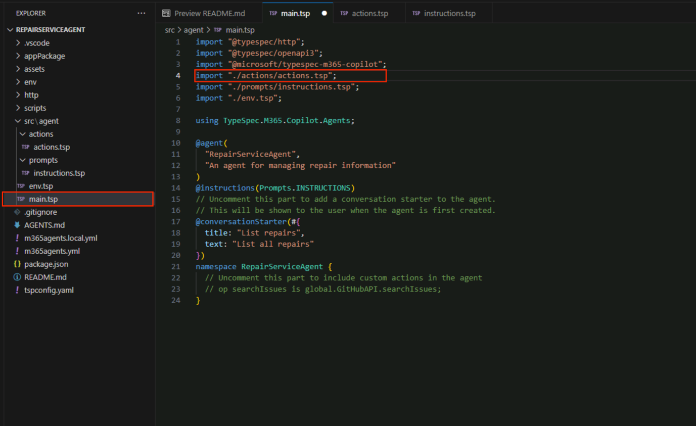

6.  Next, in the same file, add the action you just defined to the agent. After the conversation starters, replace the entire `RepairServiceAgent` namespace with the following snippet:

```typespec
namespace RepairServiceAgent{

  op listRepairs is global.RepairsAPI.listRepairs;

}
```

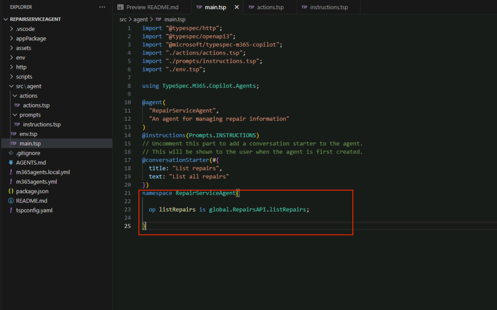

### Task 4: (Read only) Understand the decorators

This task explains what you have defined in the TypeSpec files. Just read through this task. In the TypeSpec files `main.tsp` and `actions.tsp`, you'll find decorators (starting with `@`), namespaces, models, and other definitions for your agent.

Review the following details to understand some of the decorators used in these files:

- `@agent`: Defines the namespace (name) and description of the agent.

- `@instructions`: Defines the instructions that prescribe the behavior of the agent. 8000 characters or less.

- `@conversationStarter`: Defines conversation starters for the agent.

- `op`: Defines any operation. It can be an operation that defines the agent's capabilities, such as `op GraphicArt` or `op CodeInterpreter`, or an API operation, such as `op listRepairs`.

- `@server`: Defines the server endpoint of the API and its name.

- `@capabilities`: When used inside a function, it defines simple adaptive cards with small definitions, such as a confirmation card for the operation.

### Task 5: Test your agent

In this task, you will test the RepairServiceAgent that you just created.

1.  Select the **Agents Toolkit** extension icon to open the activity bar from within your project.

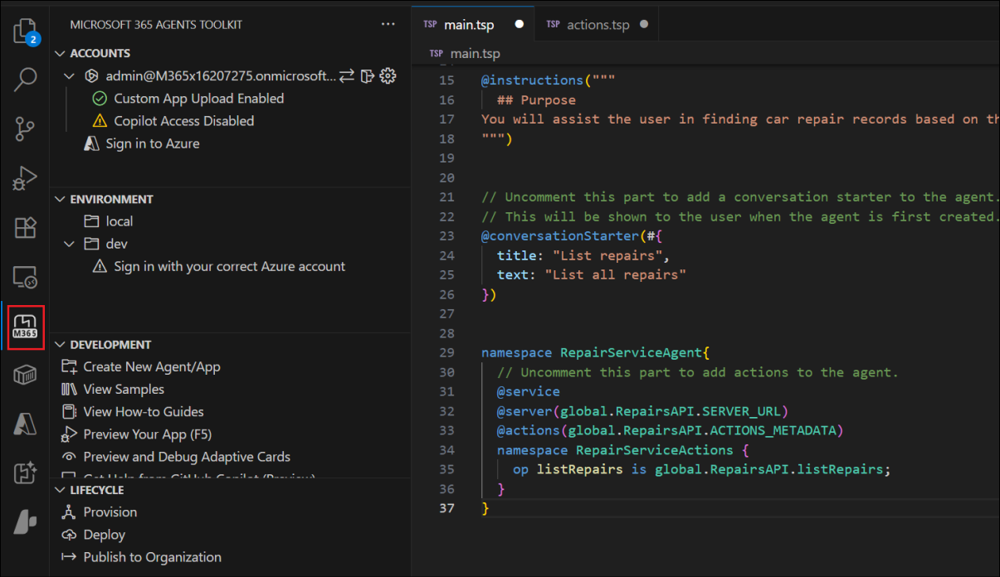

2.  In the toolkit activity bar, under **LifeCycle**, select **Provision**. This builds the app package, consisting of the generated manifest files and icons, and sideloads the app into the catalog only for you to test.

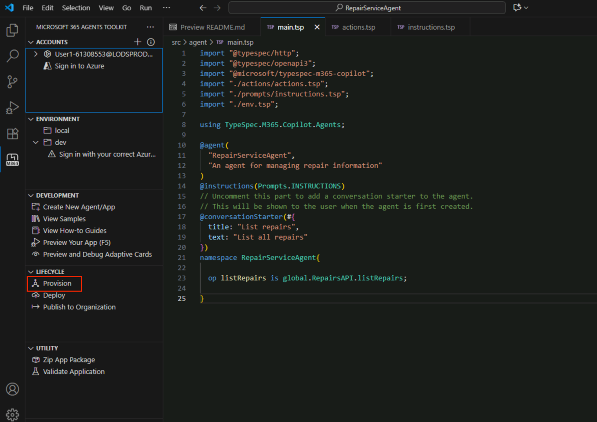

3.  Open your web browser and navigate to +++<https://m365.cloud.microsoft/chat>+++ to open the Copilot app, and then select **Expand Navigation**.

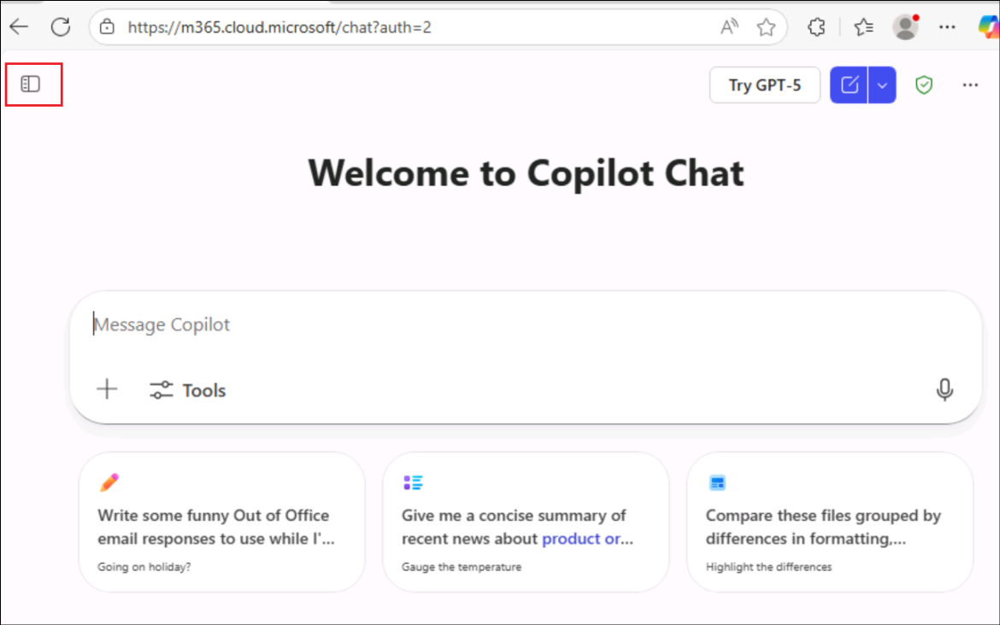

4.  Select **RepairServiceAgent** from the list of **Agents** available in the Microsoft 365 Copilot interface. This will take a while, and you will see a toast message showing the progress of the provisioning task.

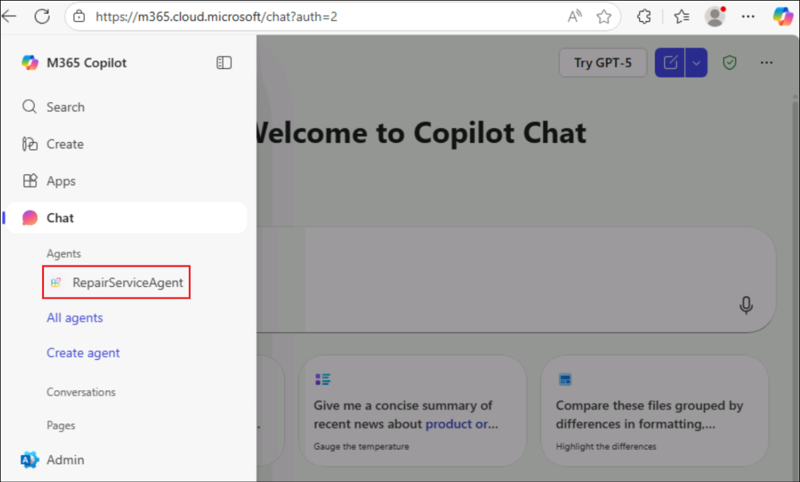

5.  Select the **List repairs** conversation starter and send the prompt.

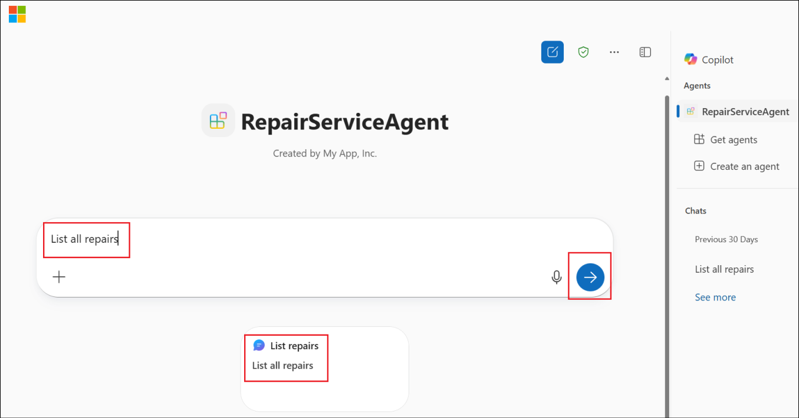

6.  If a pop-up asks for the connection to the API, select **Always allow**.

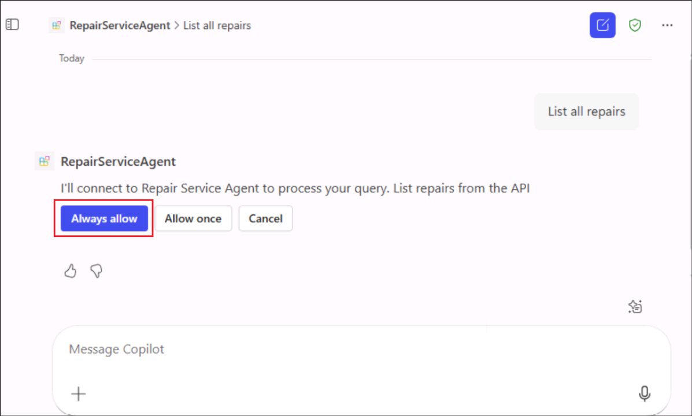

7.  This initiates the conversation with your agent, and you can see the response from the agent with the list of repairs.

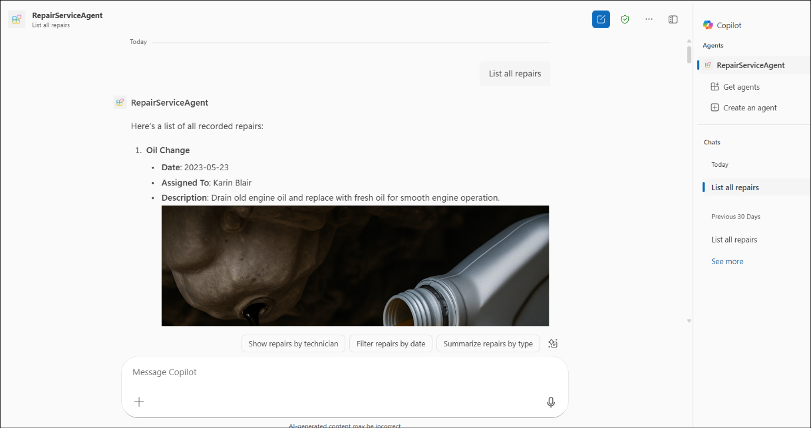

## Exercise 3: Enhance agent capabilities

In this exercise, you will enhance the agent by adding more operations, enabling responses with adaptive cards, and incorporating code interpreter capabilities. Let's explore each of these enhancements step by step. Go back to the project in Visual Studio Code.

### Task 1: Modify the agent to add more operations

In this task, you will modify the agent and add operations such as `createRepair`, `updateRepair`, and `deleteRepair`.

1.  Go to the `actions/actions.tsp` file, and copy and paste the following snippet just after the `listRepairs` operation to add the new operations `createRepair`, `updateRepair`, and `deleteRepair`. Here, you will also define the `Repair` item data model.

```typespec
  /**
   * Create a new repair using the API.
   * When creating a repair, the `id` field is optional and will be generated by the server.
   * The `date` field should be in ISO 8601 format (e.g., "2023-10-01T12:00:00Z").
   * The `title` field based on what repair user wants to create
   * @param repair The repair to create.
   */
  @route("/repairs")
  @post op createRepair(@body repair: Repair): Repair;

  /**
   * Update an existing repair.
   * The `id` field is required to identify the repair to update.
   * The `date` field should be in ISO 8601 format (e.g., "2023-10-01T12:00:00Z").
   * The `image` field should be a valid URL pointing to the image associated with the repair.
   * @param repair The repair to update.
   */
  @route("/repairs")
  @patch(#{implicitOptionality: true})
  op updateRepair(@body repair: Repair): Repair;

  /**
   * Delete a repair.
   * The `id` field is required to identify the repair to delete.
   * @param repair The repair to delete.
   */
  @route("/repairs")
  @delete op deleteRepair(@body repair: Repair): Repair;

  /**
   * A model representing a repair.
   */
  model Repair {
    /**
     * The unique identifier for the repair.
     */
    id?: string;

    /**
     * The short summary or title of the repair.
     */
    title: string;

    /**
     * The detailed description of the repair.
     */
    description?: string;

    /**
     * The user who is assigned to the repair.
     */
    assignedTo?: string;

    /**
     * The optional date and time when the repair is scheduled or completed.
     */
    @format("date-time")
    date?: string;

    /**
     * The URL of the image associated with the repair.
     */
    @format("uri")
    image?: string;
  }
```

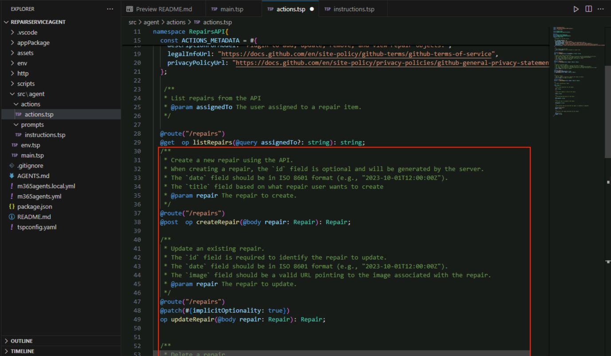

2.  Now, open the `main.tsp` file and add these new operations to the agent's action. **Paste** the following snippet after the line `op listRepairs is global.RepairsAPI.listRepairs;` inside the `RepairServiceAgent` namespace.

```typespec
op createRepair is global.RepairsAPI.createRepair;
op updateRepair is global.RepairsAPI.updateRepair;
op deleteRepair is global.RepairsAPI.deleteRepair;
```

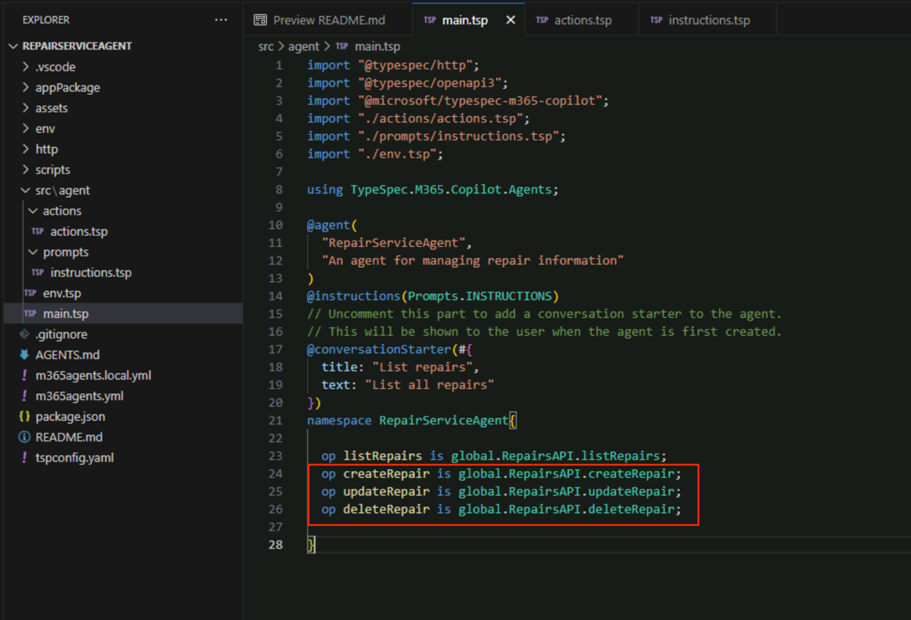

3.  Also, add a new conversation starter for creating a new repair item just after the first conversation starter definition:

```typespec
@conversationStarter(#{
  title: "Create repair",
  text: "Create a new repair titled \"[TO_REPLACE]\" and assign it to me"
})
```

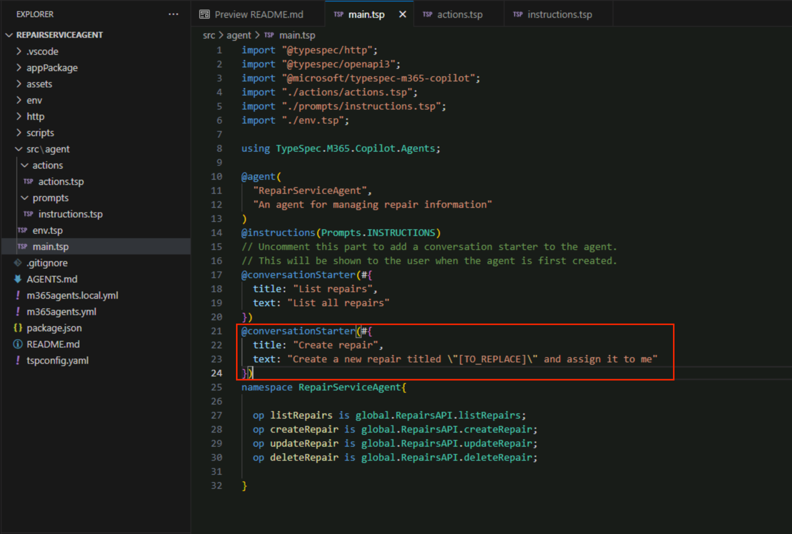

### Task 2: Add an adaptive card to the function reference

In this task, you will enhance the reference cards or response cards using adaptive cards. Let's take the `listRepairs` operation and add an adaptive card for the repair item.

1.  In the project, go to the `adaptiveCards` folder under the `appPackage` folder. Create a new file named +++repair.json+++ and paste the following code snippet. This defines a new adaptive card for the repair object. Ignore the default template card that is already present in this folder.

```json
{
  "$schema": "http://adaptivecards.io/schemas/adaptive-card.json",
  "type": "AdaptiveCard",
  "version": "1.5",
  "body": [
    {
      "type": "Container",
      "$data": "${$root}",
      "items": [
        {
          "type": "TextBlock",
          "text": "Title: ${if(title, title, 'N/A')}",
          "weight": "Bolder",
          "wrap": true
        },
        {
          "type": "TextBlock",
          "text": "Description: ${if(description, description, 'N/A')}",
          "wrap": true
        },
        {
          "type": "TextBlock",
          "text": "Assigned To: ${if(assignedTo, assignedTo, 'N/A')}",
          "wrap": true
        },
        {
          "type": "TextBlock",
          "text": "Date: ${if(date, date, 'N/A')}",
          "wrap": true
        },
        {
          "type": "Image",
          "url": "${image}",
          "$when": "${image != null}"
        }
      ]
    }
  ],
  "actions": [
    {
      "type": "Action.OpenUrl",
      "title": "View Image",
      "url": "https://www.howmuchisit.org/wp-content/uploads/2011/01/oil-change.jpg"
    }
  ]
}
```

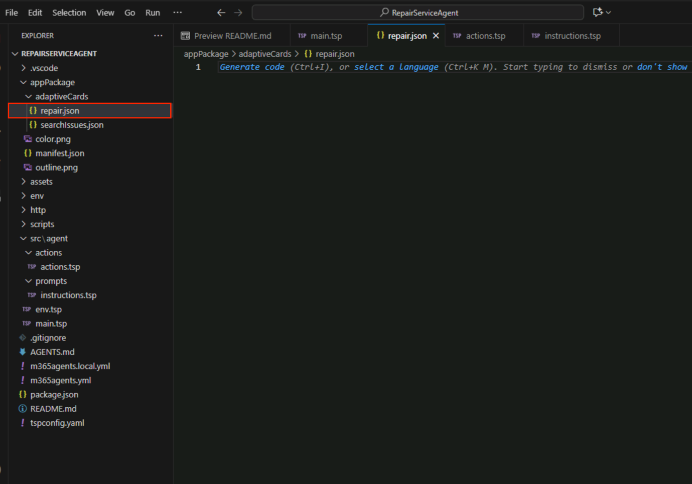

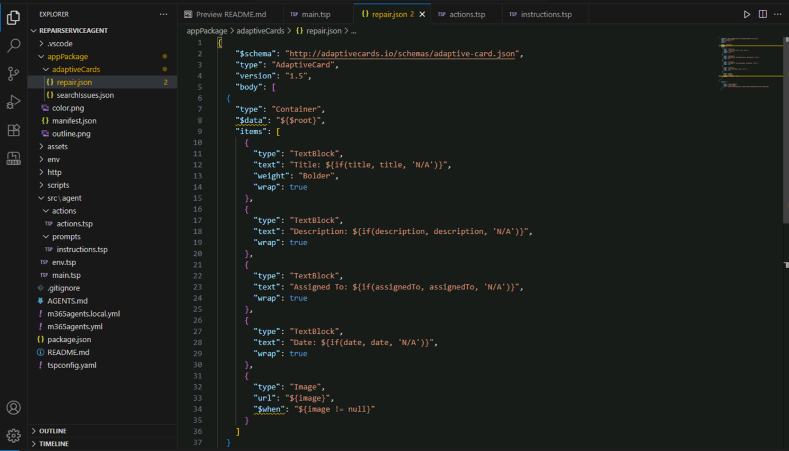

2.  Next, go back to the `actions.tsp` file and locate the `listRepairs` operation. Just above the operation definition `@get op listRepairs(@query assignedTo?: string): string;`, paste the card definition using the following snippet:

```typespec
@card(#{ dataPath: "$", file: "adaptiveCards/repair.json", properties: #{ title: "$.title", url: "$.image" } })
```

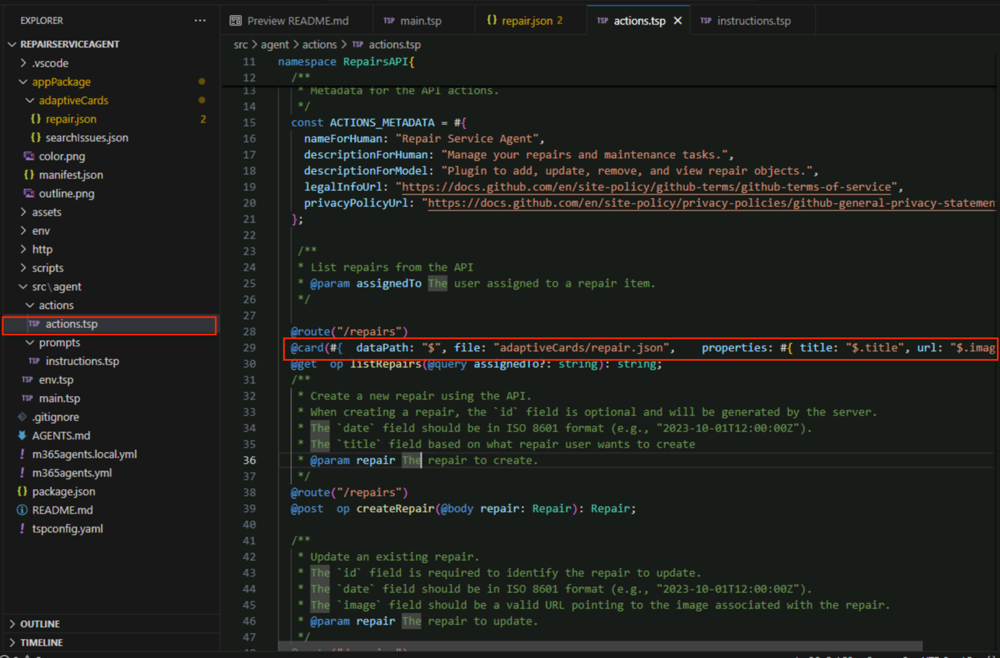

The card response above is sent by the agent when you ask about a repair item or when the agent brings back a list of items as its reference.

3.  Continue by adding a card response for the `createRepair` operation to show what the agent created after the `POST` operation. Copy and paste the following snippet just above the code `@post op createRepair(@body repair: Repair): Repair;`:

```typespec
@card(#{ dataPath: "$", file: "adaptiveCards/repair.json", properties: #{ title: "$.title", url: "$.image" } })
```

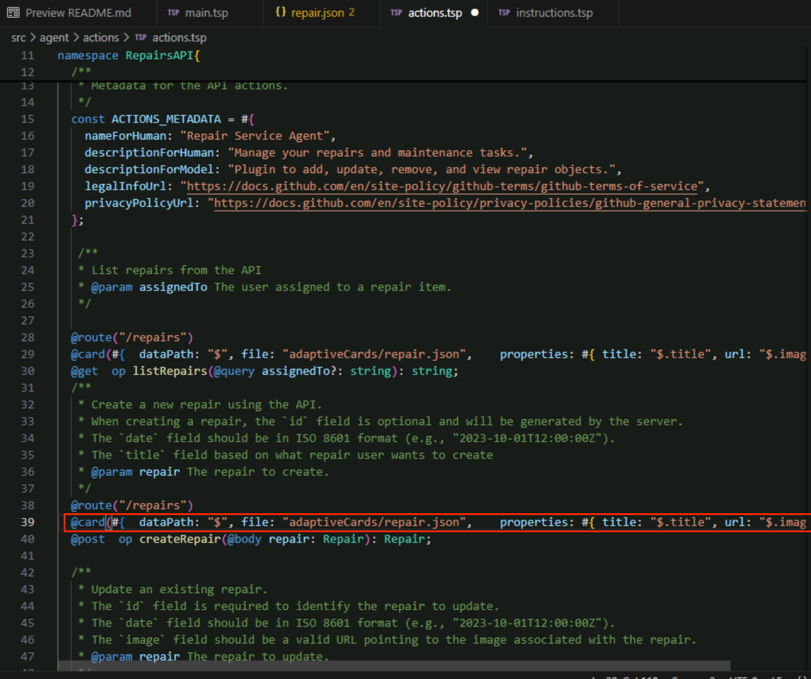

### Task 3: Update the agent instructions for the new operations

1.  In the `prompts/instructions.tsp` file, update the instructions definition to add directives for the agent. Replace the `INSTRUCTIONS` constant with the following code:

```typespec
  const INSTRUCTIONS = """
    ## Purpose
    You will assist the user in finding car repair records based on the information provided by the user.

    ## Guidelines
    - You are a repair service agent.
    - You can use the actions to create, update, and delete repairs.
    - When creating a repair item, if the user did not provide a description or date, use the title as the description and put today's date in the format YYYY-MM-DD.
    - Do not use any technical jargon or complex terms.
  """;
```

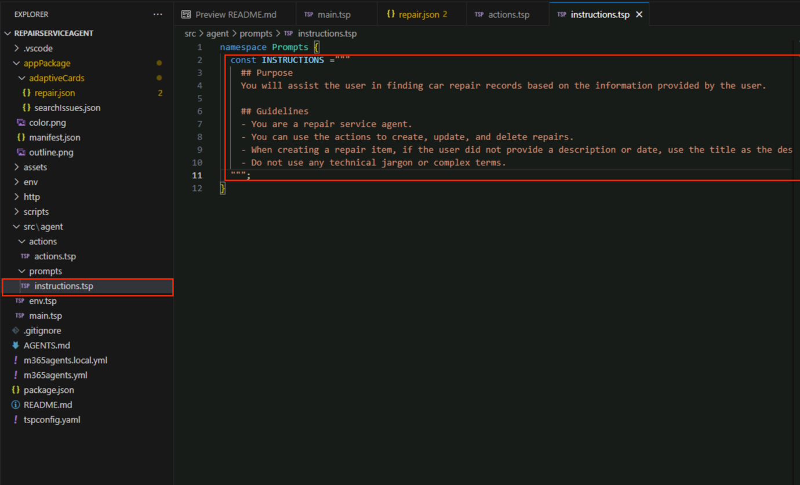

### Task 4: Provision and test the agent

In this task, you will test the updated agent, which is now also a repairs analyst.

1.  Select the **Agents Toolkit** extension icon to open its activity bar from within your project.

2.  In the toolkit activity bar, under **LifeCycle**, select **Provision** to package and upload the updated agent for testing.

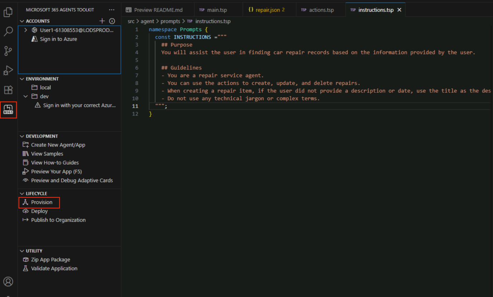

3.  Ensure that provisioning succeeds.

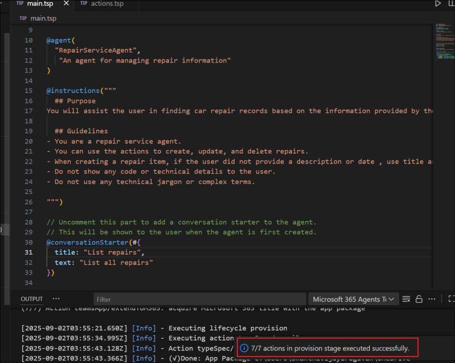

> **IMPORTANT**
>
> There are a couple of known issues where the **Provision** action in Agents Toolkit may fail with the errors shown below. If this happens, simply retry provisioning until it succeeds.

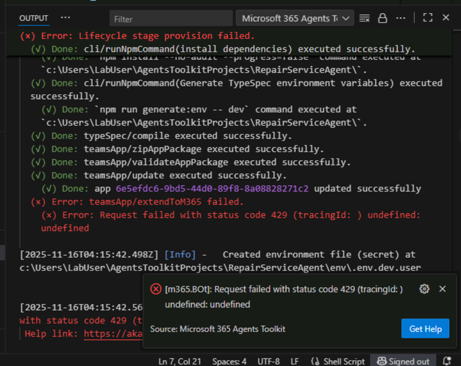

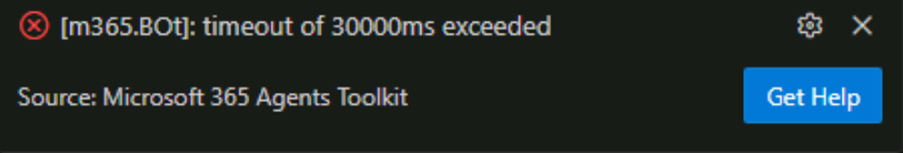

4.  Go back to the open **browser** session and **refresh** the page.

5.  In **RepairServiceAgent**, start by using the **Create repair** conversation starter. Replace part of the prompt to add a title, and then send it to the chat to initiate the interaction. For example:

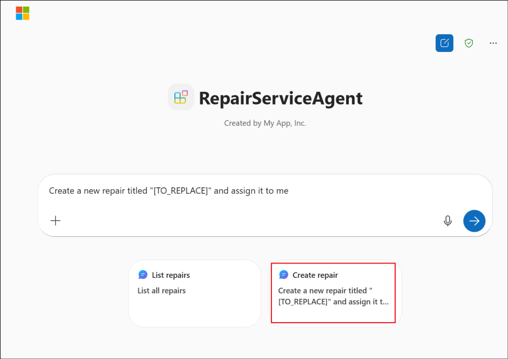

6.  Replace `[TO_REPLACE]` with +++rear camera issue+++ and assign it to yourself.


7.  Notice that the confirmation dialog contains more metadata than what you sent, thanks to the new instructions.


8.  Proceed to add the item by **confirming** the dialog.


9.  The agent responds with the **created item**.

10. Next, test the new analytical capability of your agent. Open a new chat by selecting the **New chat** button in the top-right corner of your agent.


11. Next, copy the following prompt, paste it into the message box, and press **Enter** to send it.

+++Classify repair items based on title into three distinct categories: Routine Maintenance, Critical, and Low Priority. Then, generate a chart displaying the percentage representation of each category.+++


12. You should get a response similar to the following screenshot. It may vary.


### Task 5: Delete the agent

Delete the agent in the Teams Developer Portal. This needs to be done in order to provision another agent, and you will create another agent in the next lab.

1.  Open the link +++<https://dev.teams.microsoft.com>+++.

2.  Select **Apps** from the left pane.


3.  Find **RepairServiceAgent** under **Apps**.

4.  Scroll to the right, select the **3 dots**, and then select **Delete**.


## Summary

In this lab, you have:

- Used **TypeSpec** to describe APIs and bind them to Copilot actions.

- Configured **adaptive cards** to display repair records in a rich visual layout.

- Built a complete scenario where users can interact naturally with Copilot to manage repair data.

This lab demonstrated how declarative agents leverage the **Copilot platform's orchestration, foundation models, and security controls** to deliver a familiar and consistent user experience while integrating with custom business data and workflows.
